# BỘ TÀI LIỆU ĐẶC TẢ SƠ ĐỒ HỆ THỐNG (DIAGRAMS SPECIFICATION)
> Tài liệu trung gian chuẩn hóa sơ đồ kỹ thuật phục vụ Báo cáo Đồ án Tốt nghiệp.  
> Đảm bảo tính thoáng đãng, chống chồng chéo nhãn chữ và cân đối bố cục trang tài liệu A4.

---

## 1. Sơ đồ Kiến trúc Clean Architecture 5 Tầng (Hình 2.1)
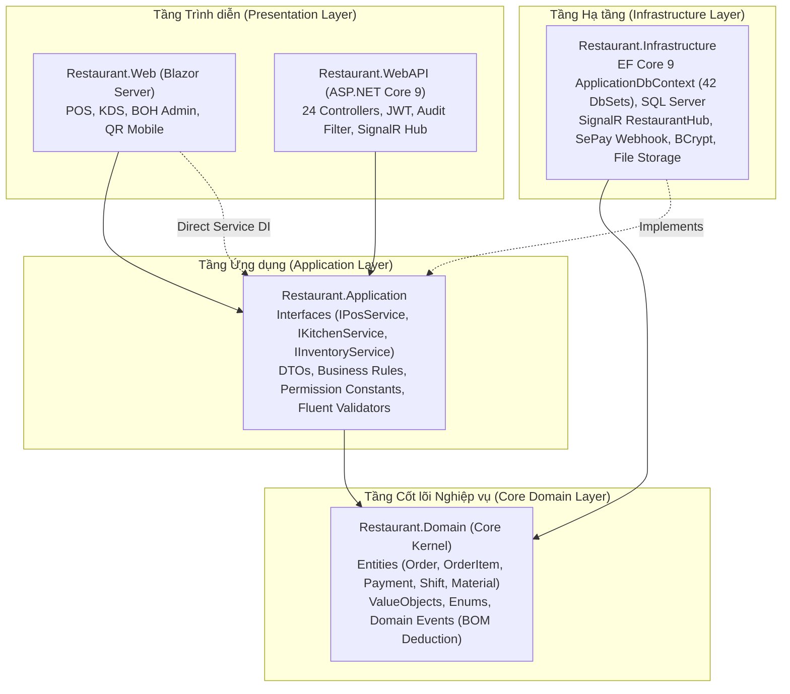
```mermaid
graph TD
    subgraph Presentation["Tầng Trình diễn (Presentation Layer)"]
        UI["Restaurant.Web (Blazor Server)<br/>POS, KDS, BOH Admin, QR Mobile"]
        API["Restaurant.WebAPI (ASP.NET Core 9)<br/>24 Controllers, JWT, Audit Filter, SignalR Hub"]
    end

    subgraph Application["Tầng Ứng dụng (Application Layer)"]
        App["Restaurant.Application<br/>Interfaces (IPosService, IKitchenService, IInventoryService)<br/>DTOs, Business Rules, Permission Constants, Fluent Validators"]
    end

    subgraph Domain["Tầng Cốt lõi Nghiệp vụ (Core Domain Layer)"]
        Dom["Restaurant.Domain (Core Kernel)<br/>Entities (Order, OrderItem, Payment, Shift, Material)<br/>ValueObjects, Enums, Domain Events (BOM Deduction)"]
    end

    subgraph Infrastructure["Tầng Hạ tầng (Infrastructure Layer)"]
        Infra["Restaurant.Infrastructure<br/>EF Core 9 ApplicationDbContext (42 DbSets), SQL Server<br/>SignalR RestaurantHub, SePay Webhook, BCrypt, File Storage"]
    end

    UI --> App
    API --> App
    App --> Dom
    Infra --> Dom
    Infra -.->|Implements| App
    UI -.->|Direct Service DI| App
```

---

## 2. Sơ đồ Tuần tự Xử lý Yêu cầu (Hình 2.2)
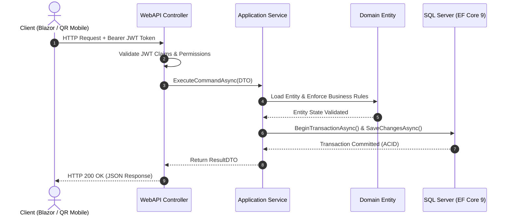
```mermaid
sequenceDiagram
    autonumber
    actor Client as Client (Blazor / QR Mobile)
    participant Ctrl as WebAPI Controller
    participant Svc as Application Service
    participant Dom as Domain Entity
    participant DB as SQL Server (EF Core 9)

    Client->>Ctrl: HTTP Request + Bearer JWT Token
    Ctrl->>Ctrl: Validate JWT Claims & Permissions
    Ctrl->>Svc: ExecuteCommandAsync(DTO)
    Svc->>Dom: Load Entity & Enforce Business Rules
    Dom-->>Svc: Entity State Validated
    Svc->>DB: BeginTransactionAsync() & SaveChangesAsync()
    DB-->>Svc: Transaction Committed (ACID)
    Svc-->>Ctrl: Return ResultDTO
    Ctrl-->>Client: HTTP 200 OK (JSON Response)
```

---

## 3. Sơ đồ Tuần tự Luồng Đặt món QR, Duyệt POS và Chế biến KDS (Hình 2.3)
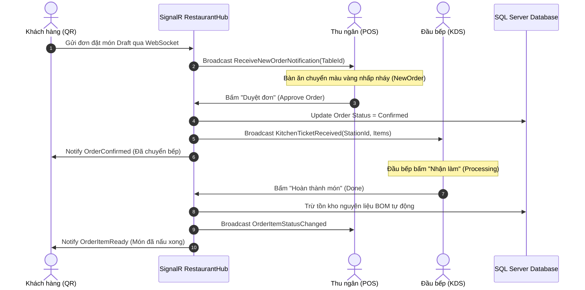
```mermaid
sequenceDiagram
    autonumber
    actor Cust as Khách hàng (QR)
    participant Hub as SignalR RestaurantHub
    actor Cashier as Thu ngân (POS)
    actor Chef as Đầu bếp (KDS)
    participant DB as SQL Server Database

    Cust->>Hub: Gửi đơn đặt món Draft qua WebSocket
    Hub->>Cashier: Broadcast ReceiveNewOrderNotification(TableId)
    Note over Cashier: Bàn ăn chuyển màu vàng nhấp nháy (NewOrder)
    Cashier->>Hub: Bấm "Duyệt đơn" (Approve Order)
    Hub->>DB: Update Order Status = Confirmed
    Hub->>Chef: Broadcast KitchenTicketReceived(StationId, Items)
    Hub->>Cust: Notify OrderConfirmed (Đã chuyển bếp)
    Note over Chef: Đầu bếp bấm "Nhận làm" (Processing)
    Chef->>Hub: Bấm "Hoàn thành món" (Done)
    Hub->>DB: Trừ tồn kho nguyên liệu BOM tự động
    Hub->>Cashier: Broadcast OrderItemStatusChanged
    Hub->>Cust: Notify OrderItemReady (Món đã nấu xong)
```

---

## 4. Sơ đồ Chuyển đổi Trạng thái Bàn ăn - Table State Machine (Hình 2.4)

```mermaid
flowchart LR
    Init(( )) --> |Khởi tạo bàn mới| Available[Available<br/>Bàn trống]
    Available --> |Khách quét QR / Mở bàn| Occupied[Occupied<br/>Đang phục vụ]
    Occupied --> |Khách gửi đơn QR| NewOrder[NewOrder<br/>Đơn chờ duyệt]
    NewOrder --> |Thu ngân duyệt đơn| Occupied
    Occupied --> |In tạm tính K80| Billing[Billing<br/>Chờ thanh toán]
    Billing --> |Thanh toán thành công| Available

    style Init fill:#334155,stroke:#0f172a,stroke-width:2px
    style Available fill:#f1f5f9,stroke:#64748b,stroke-width:1.5px
    style Occupied fill:#fee2e2,stroke:#ef4444,stroke-width:1.5px
    style NewOrder fill:#fef3c7,stroke:#f59e0b,stroke-width:1.5px
    style Billing fill:#ecfdf5,stroke:#10b981,stroke-width:1.5px
```

---

## 5. Sơ đồ Chuyển đổi Trạng thái Đơn hàng - Order State Machine (Hình 2.5)

```mermaid
flowchart TD
    Init(( )) --> |Khách gửi đơn qua QR| Draft[Draft<br/>Đơn tạm]
    Init --> |Thu ngân tạo tại POS| Confirmed[Confirmed<br/>Đã xác nhận]
    
    Draft --> |Thu ngân duyệt đơn| Confirmed
    
    subgraph CancelGroup [" "]
        Draft --> |Từ chối duyệt đơn QR| Cancelled[Cancelled<br/>Đã hủy đơn]
        Confirmed --> |Hủy đơn cần mã PIN| Cancelled
        Cancelled --> Closed((( )))
    end

    Confirmed --> |Bếp nấu xong món| Completed[Completed<br/>Hoàn tất nấu]
    Confirmed --> |Thanh toán ngay món đóng chai| Paid[Paid<br/>Đã thanh toán]
    Completed --> |Khách thanh toán Tiền mặt hoặc VietQR| Paid
    Paid --> Done((( )))

    style Init fill:#334155,stroke:#0f172a,stroke-width:2px
    style Done fill:#ede9fe,stroke:#7c3aed,stroke-width:3px
    style Closed fill:#fee2e2,stroke:#ef4444,stroke-width:3px
    style Draft fill:#f8fafc,stroke:#64748b,stroke-width:1.5px
    style Confirmed fill:#eff6ff,stroke:#3b82f6,stroke-width:1.5px
    style Completed fill:#fef3c7,stroke:#f59e0b,stroke-width:1.5px
    style Paid fill:#ecfdf5,stroke:#10b981,stroke-width:1.5px
    style Cancelled fill:#fef2f2,stroke:#ef4444,stroke-width:1.5px
    style CancelGroup fill:none,stroke:none
```

---

## 6. Sơ đồ Chuyển đổi Trạng thái Món ăn trong Bếp - OrderItem State Machine (Hình 2.6)

```mermaid
flowchart TD
    Init(( )) --> |Đơn chuyển Confirmed| Pending[Pending<br/>Chờ chế biến]
    Pending --> |Đầu bếp nhận làm trên KDS| Processing[Processing<br/>Đang chế biến]
    Pending --> |Đầu bếp làm xong nhanh| Done[Done<br/>Hoàn thành món]
    Processing --> |Đầu bếp làm xong trên KDS| Done
    Done --> |Bê món phục vụ khách| End1((( )))

    subgraph VoidArea [" "]
        Pending --> |Hủy món chưa nấu| Cancelled[Cancelled<br/>Hủy món Void]
        Processing --> |Hủy món đang nấu cần PIN| Cancelled
        Cancelled --> End2((( )))
    end

    style Init fill:#334155,stroke:#0f172a,stroke-width:2px
    style End1 fill:#ede9fe,stroke:#7c3aed,stroke-width:3px
    style End2 fill:#fee2e2,stroke:#ef4444,stroke-width:3px
    style Pending fill:#f8fafc,stroke:#64748b,stroke-width:1.5px
    style Processing fill:#fef3c7,stroke:#f59e0b,stroke-width:1.5px
    style Done fill:#ecfdf5,stroke:#10b981,stroke-width:1.5px
    style Cancelled fill:#fef2f2,stroke:#ef4444,stroke-width:1.5px
    style VoidArea fill:none,stroke:none
```

---

## 7. Sơ đồ Trạng thái Giao dịch Thanh toán - Payment State Machine (Hình 2.7)
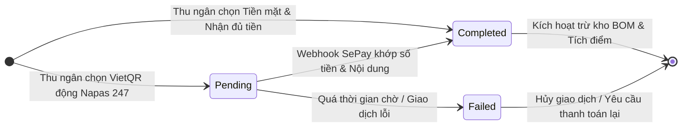
```mermaid
stateDiagram-v2
    direction LR
    [*] --> Pending : Thu ngân chọn VietQR động Napas 247
    [*] --> Completed : Thu ngân chọn Tiền mặt & Nhận đủ tiền
    Pending --> Completed : Webhook SePay khớp số tiền & Nội dung
    Pending --> Failed : Quá thời gian chờ / Giao dịch lỗi
    Completed --> [*] : Kích hoạt trừ kho BOM & Tích điểm
    Failed --> [*] : Hủy giao dịch / Yêu cầu thanh toán lại
```

---

## 8. Sơ đồ Trạng thái Ca làm việc - Shift State Machine (Hình 2.8)
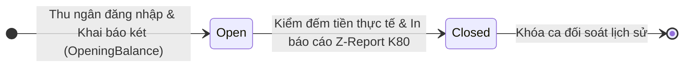
```mermaid
stateDiagram-v2
    direction LR
    [*] --> Open : Thu ngân đăng nhập & Khai báo két (OpeningBalance)
    Open --> Closed : Kiểm đếm tiền thực tế & In báo cáo Z-Report K80
    Closed --> [*] : Khóa ca đối soát lịch sử
```

---

## 9. Sơ đồ Trạng thái Phiếu Kiểm kê Kho - Stocktake State Machine (Hình 2.9)
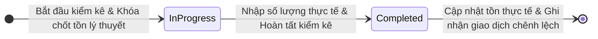
```mermaid
stateDiagram-v2
    direction LR
    [*] --> InProgress : Bắt đầu kiểm kê & Khóa chốt tồn lý thuyết
    InProgress --> Completed : Nhập số lượng thực tế & Hoàn tất kiểm kê
    Completed --> [*] : Cập nhật tồn thực tế & Ghi nhận giao dịch chênh lệch
```

---

## 10. Sơ đồ ERD Phân hệ Người dùng, Phân quyền và Bàn ăn (Hình 2.10)
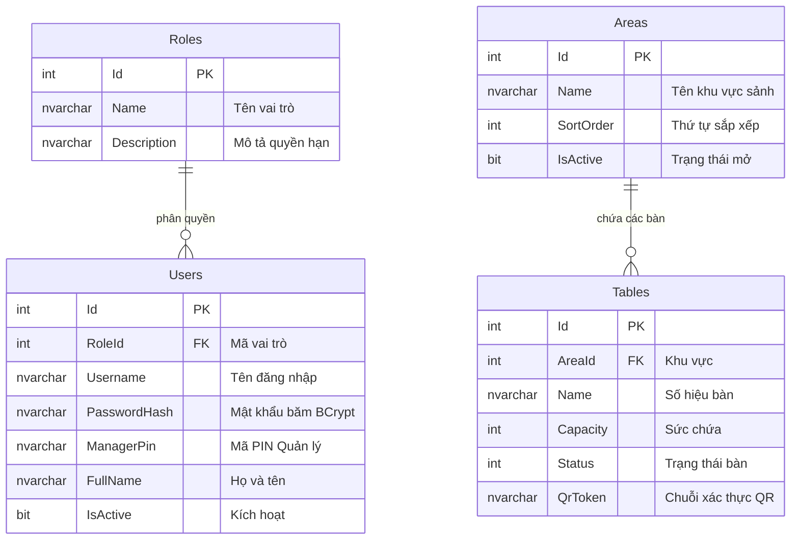
```mermaid
erDiagram
    Roles ||--o{ Users : "phân quyền"
    Areas ||--o{ Tables : "chứa các bàn"
    
    Roles {
        int Id PK
        nvarchar Name "Tên vai trò"
        nvarchar Description "Mô tả quyền hạn"
    }
    Users {
        int Id PK
        int RoleId FK "Mã vai trò"
        nvarchar Username "Tên đăng nhập"
        nvarchar PasswordHash "Mật khẩu băm BCrypt"
        nvarchar ManagerPin "Mã PIN Quản lý"
        nvarchar FullName "Họ và tên"
        bit IsActive "Kích hoạt"
    }
    Areas {
        int Id PK
        nvarchar Name "Tên khu vực sảnh"
        int SortOrder "Thứ tự sắp xếp"
        bit IsActive "Trạng thái mở"
    }
    Tables {
        int Id PK
        int AreaId FK "Khu vực"
        nvarchar Name "Số hiệu bàn"
        int Capacity "Sức chứa"
        int Status "Trạng thái bàn"
        nvarchar QrToken "Chuỗi xác thực QR"
    }
```

---

## 11. Sơ đồ ERD Danh mục và Món ăn (Hình 2.11a)
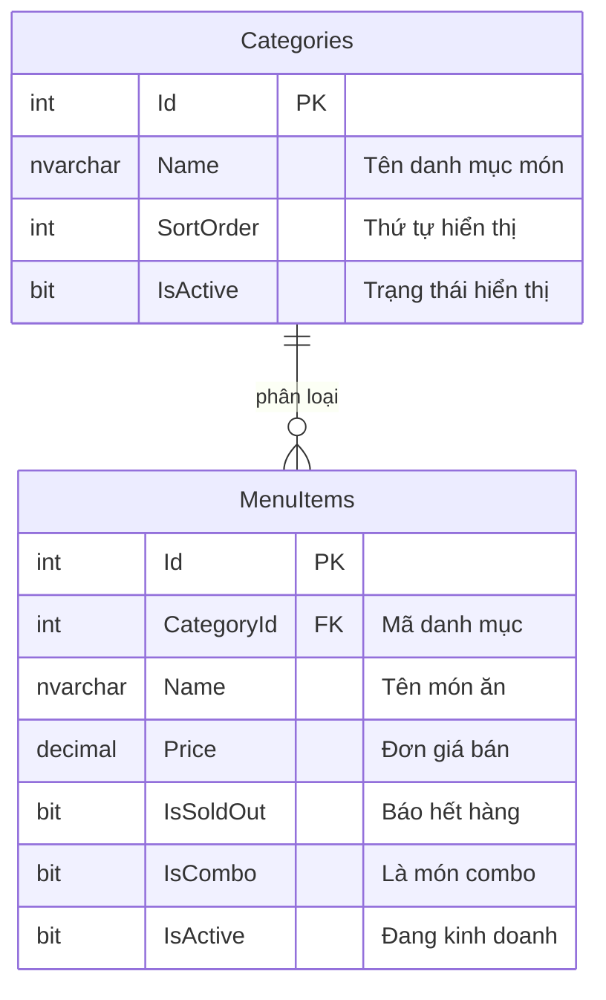
```mermaid
erDiagram
    Categories ||--o{ MenuItems : "phân loại"
    
    Categories {
        int Id PK
        nvarchar Name "Tên danh mục món"
        int SortOrder "Thứ tự hiển thị"
        bit IsActive "Trạng thái hiển thị"
    }
    MenuItems {
        int Id PK
        int CategoryId FK "Mã danh mục"
        nvarchar Name "Tên món ăn"
        decimal Price "Đơn giá bán"
        bit IsSoldOut "Báo hết hàng"
        bit IsCombo "Là món combo"
        bit IsActive "Đang kinh doanh"
    }
```

---

## 12. Sơ đồ ERD Tùy chọn Modifiers và Liên kết Thực đơn (Hình 2.11b)
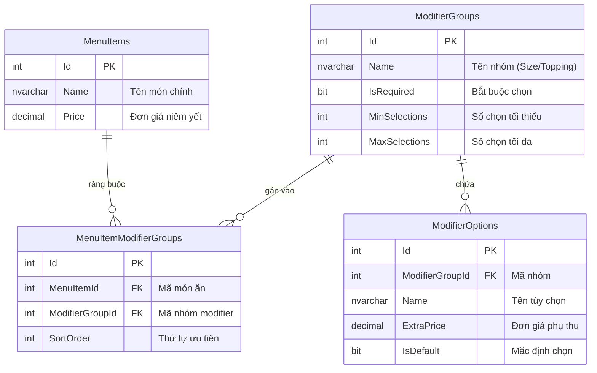
```mermaid
erDiagram
    MenuItems ||--o{ MenuItemModifierGroups : "ràng buộc"
    ModifierGroups ||--o{ MenuItemModifierGroups : "gán vào"
    ModifierGroups ||--o{ ModifierOptions : "chứa"
    
    MenuItems {
        int Id PK
        nvarchar Name "Tên món chính"
        decimal Price "Đơn giá niêm yết"
    }
    MenuItemModifierGroups {
        int Id PK
        int MenuItemId FK "Mã món ăn"
        int ModifierGroupId FK "Mã nhóm modifier"
        int SortOrder "Thứ tự ưu tiên"
    }
    ModifierGroups {
        int Id PK
        nvarchar Name "Tên nhóm (Size/Topping)"
        bit IsRequired "Bắt buộc chọn"
        int MinSelections "Số chọn tối thiểu"
        int MaxSelections "Số chọn tối đa"
    }
    ModifierOptions {
        int Id PK
        int ModifierGroupId FK "Mã nhóm"
        nvarchar Name "Tên tùy chọn"
        decimal ExtraPrice "Đơn giá phụ thu"
        bit IsDefault "Mặc định chọn"
    }
```

---

## 13. Sơ đồ ERD Đơn hàng, Dòng món chi tiết và Hủy món (Hình 2.12a)
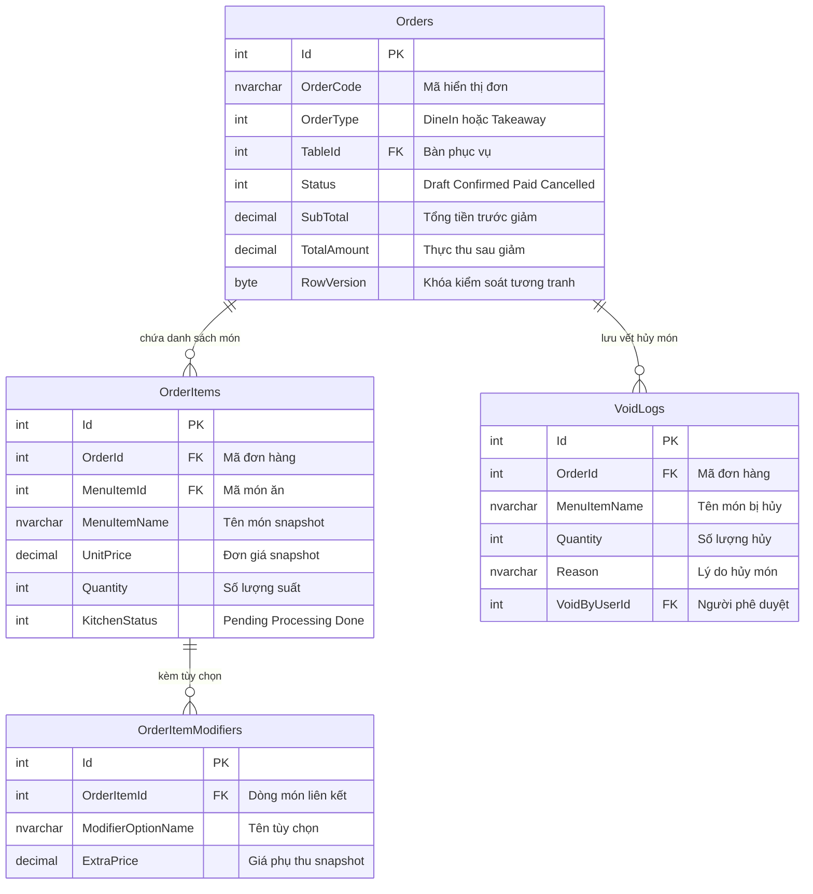
```mermaid
erDiagram
    Orders ||--o{ OrderItems : "chứa danh sách món"
    OrderItems ||--o{ OrderItemModifiers : "kèm tùy chọn"
    Orders ||--o{ VoidLogs : "lưu vết hủy món"
    
    Orders {
        int Id PK
        nvarchar OrderCode "Mã hiển thị đơn"
        int OrderType "DineIn hoặc Takeaway"
        int TableId FK "Bàn phục vụ"
        int Status "Draft Confirmed Paid Cancelled"
        decimal SubTotal "Tổng tiền trước giảm"
        decimal TotalAmount "Thực thu sau giảm"
        byte RowVersion "Khóa kiểm soát tương tranh"
    }
    OrderItems {
        int Id PK
        int OrderId FK "Mã đơn hàng"
        int MenuItemId FK "Mã món ăn"
        nvarchar MenuItemName "Tên món snapshot"
        decimal UnitPrice "Đơn giá snapshot"
        int Quantity "Số lượng suất"
        int KitchenStatus "Pending Processing Done"
    }
    OrderItemModifiers {
        int Id PK
        int OrderItemId FK "Dòng món liên kết"
        nvarchar ModifierOptionName "Tên tùy chọn"
        decimal ExtraPrice "Giá phụ thu snapshot"
    }
    VoidLogs {
        int Id PK
        int OrderId FK "Mã đơn hàng"
        nvarchar MenuItemName "Tên món bị hủy"
        int Quantity "Số lượng hủy"
        nvarchar Reason "Lý do hủy món"
        int VoidByUserId FK "Người phê duyệt"
    }
```

---

## 14. Sơ đồ ERD Giao dịch Thanh toán, Webhook SePay và Mã giảm giá (Hình 2.12b)
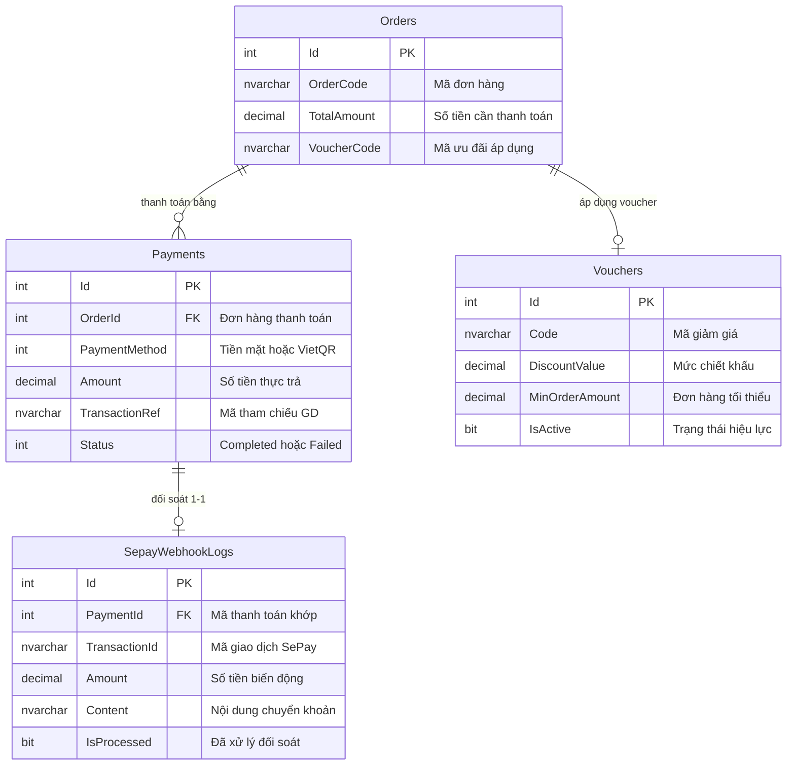
```mermaid
erDiagram
    Orders ||--o{ Payments : "thanh toán bằng"
    Payments ||--o| SepayWebhookLogs : "đối soát 1-1"
    Orders ||--o| Vouchers : "áp dụng voucher"
    
    Orders {
        int Id PK
        nvarchar OrderCode "Mã đơn hàng"
        decimal TotalAmount "Số tiền cần thanh toán"
        nvarchar VoucherCode "Mã ưu đãi áp dụng"
    }
    Payments {
        int Id PK
        int OrderId FK "Đơn hàng thanh toán"
        int PaymentMethod "Tiền mặt hoặc VietQR"
        decimal Amount "Số tiền thực trả"
        nvarchar TransactionRef "Mã tham chiếu GD"
        int Status "Completed hoặc Failed"
    }
    SepayWebhookLogs {
        int Id PK
        int PaymentId FK "Mã thanh toán khớp"
        nvarchar TransactionId "Mã giao dịch SePay"
        decimal Amount "Số tiền biến động"
        nvarchar Content "Nội dung chuyển khoản"
        bit IsProcessed "Đã xử lý đối soát"
    }
    Vouchers {
        int Id PK
        nvarchar Code "Mã giảm giá"
        decimal DiscountValue "Mức chiết khấu"
        decimal MinOrderAmount "Đơn hàng tối thiểu"
        bit IsActive "Trạng thái hiệu lực"
    }
```

---

## 15. Sơ đồ ERD Quản lý Ca làm việc và Dòng tiền két (Hình 2.12c)
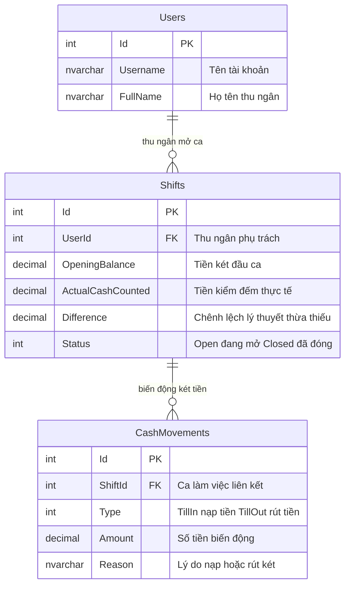
```mermaid
erDiagram
    Users ||--o{ Shifts : "thu ngân mở ca"
    Shifts ||--o{ CashMovements : "biến động két tiền"
    
    Users {
        int Id PK
        nvarchar Username "Tên tài khoản"
        nvarchar FullName "Họ tên thu ngân"
    }
    Shifts {
        int Id PK
        int UserId FK "Thu ngân phụ trách"
        decimal OpeningBalance "Tiền két đầu ca"
        decimal ActualCashCounted "Tiền kiểm đếm thực tế"
        decimal Difference "Chênh lệch lý thuyết thừa thiếu"
        int Status "Open đang mở Closed đã đóng"
    }
    CashMovements {
        int Id PK
        int ShiftId FK "Ca làm việc liên kết"
        int Type "TillIn nạp tiền TillOut rút tiền"
        decimal Amount "Số tiền biến động"
        nvarchar Reason "Lý do nạp hoặc rút két"
    }
```

---

## 16. Sơ đồ ERD Phân hệ Khách hàng Thân thiết - Loyalty & CRM (Hình 2.13)
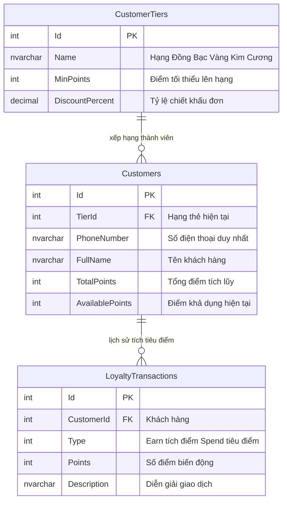
```mermaid
erDiagram
    CustomerTiers ||--o{ Customers : "xếp hạng thành viên"
    Customers ||--o{ LoyaltyTransactions : "lịch sử tích tiêu điểm"
    
    CustomerTiers {
        int Id PK
        nvarchar Name "Hạng Đồng Bạc Vàng Kim Cương"
        int MinPoints "Điểm tối thiểu lên hạng"
        decimal DiscountPercent "Tỷ lệ chiết khấu đơn"
    }
    Customers {
        int Id PK
        int TierId FK "Hạng thẻ hiện tại"
        nvarchar PhoneNumber "Số điện thoại duy nhất"
        nvarchar FullName "Tên khách hàng"
        int TotalPoints "Tổng điểm tích lũy"
        int AvailablePoints "Điểm khả dụng hiện tại"
    }
    LoyaltyTransactions {
        int Id PK
        int CustomerId FK "Khách hàng"
        int Type "Earn tích điểm Spend tiêu điểm"
        int Points "Số điểm biến động"
        nvarchar Description "Diễn giải giao dịch"
    }
```

---

## 17. Sơ đồ ERD Phân hệ Kho hàng và Định mức BOM (Hình 2.14)
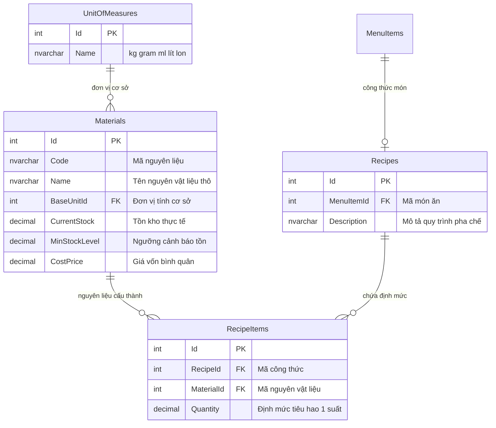
```mermaid
erDiagram
    UnitOfMeasures ||--o{ Materials : "đơn vị cơ sở"
    Materials ||--o{ RecipeItems : "nguyên liệu cấu thành"
    Recipes ||--o{ RecipeItems : "chứa định mức"
    MenuItems ||--o| Recipes : "công thức món"
    
    UnitOfMeasures {
        int Id PK
        nvarchar Name "kg gram ml lít lon"
    }
    Materials {
        int Id PK
        nvarchar Code "Mã nguyên liệu"
        nvarchar Name "Tên nguyên vật liệu thô"
        int BaseUnitId FK "Đơn vị tính cơ sở"
        decimal CurrentStock "Tồn kho thực tế"
        decimal MinStockLevel "Ngưỡng cảnh báo tồn"
        decimal CostPrice "Giá vốn bình quân"
    }
    Recipes {
        int Id PK
        int MenuItemId FK "Mã món ăn"
        nvarchar Description "Mô tả quy trình pha chế"
    }
    RecipeItems {
        int Id PK
        int RecipeId FK "Mã công thức"
        int MaterialId FK "Mã nguyên vật liệu"
        decimal Quantity "Định mức tiêu hao 1 suất"
    }
```

---

## 18. Sơ đồ Tổng thể Luồng Dữ liệu Liên Module (Hình 2.15)
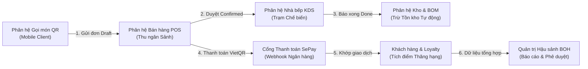
```mermaid
flowchart LR
    QR["Phân hệ Gọi món QR<br/>(Mobile Client)"] -->|1. Gửi đơn Draft| POS["Phân hệ Bán hàng POS<br/>(Thu ngân Sảnh)"]
    POS -->|2. Duyệt Confirmed| KDS["Phân hệ Nhà bếp KDS<br/>(Trạm Chế biến)"]
    KDS -->|3. Báo xong Done| BOM["Phân hệ Kho & BOM<br/>(Trừ Tồn kho Tự động)"]
    POS -->|4. Thanh toán VietQR| PAY["Cổng Thanh toán SePay<br/>(Webhook Ngân hàng)"]
    PAY -->|5. Khớp giao dịch| CRM["Khách hàng & Loyalty<br/>(Tích điểm Thăng hạng)"]
    CRM -->|6. Dữ liệu tổng hợp| BOH["Quản trị Hậu sảnh BOH<br/>(Báo cáo & Phê duyệt)"]
```

---

## 19. Biểu đồ Use Case Tổng thể Toàn Hệ thống
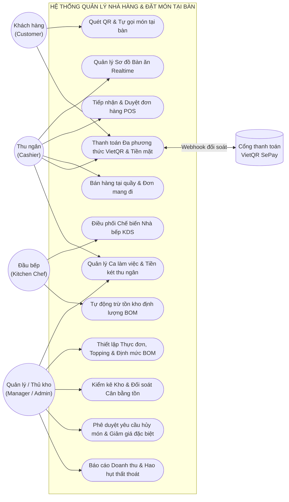
```mermaid
flowchart LR
    Customer(("Khách hàng<br/>(Customer)"))
    Cashier(("Thu ngân<br/>(Cashier)"))
    Chef(("Đầu bếp<br/>(Kitchen Chef)"))
    Admin(("Quản lý / Thủ kho<br/>(Manager / Admin)"))
    SePay[("Cổng thanh toán<br/>VietQR SePay")]

    subgraph SystemBoundary ["HỆ THỐNG QUẢN LÝ NHÀ HÀNG & ĐẶT MÓN TẠI BÀN"]
        UC1(["Quét QR & Tự gọi món tại bàn"])
        UC2(["Quản lý Sơ đồ Bàn ăn Realtime"])
        UC3(["Tiếp nhận & Duyệt đơn hàng POS"])
        UC4(["Bán hàng tại quầy & Đơn mang đi"])
        UC5(["Điều phối Chế biến Nhà bếp KDS"])
        UC6(["Thanh toán Đa phương thức VietQR & Tiền mặt"])
        UC7(["Tự động trừ tồn kho định lượng BOM"])
        UC8(["Quản lý Ca làm việc & Tiền két thu ngân"])
        UC9(["Thiết lập Thực đơn, Topping & Định mức BOM"])
        UC10(["Kiểm kê Kho & Đối soát Cân bằng tồn"])
        UC11(["Phê duyệt yêu cầu hủy món & Giảm giá đặc biệt"])
        UC12(["Báo cáo Doanh thu & Hao hụt thất thoát"])
    end

    Customer --> UC1
    Customer --> UC6
    
    Cashier --> UC2
    Cashier --> UC3
    Cashier --> UC4
    Cashier --> UC6
    Cashier --> UC8
    
    Chef --> UC5
    Chef --> UC7
    
    Admin --> UC8
    Admin --> UC9
    Admin --> UC10
    Admin --> UC11
    Admin --> UC12

    UC6 <-->|Webhook đối soát| SePay
```

---

## 20. Biểu đồ Use Case Phân rã - Phân hệ Gọi món QR (Customer)
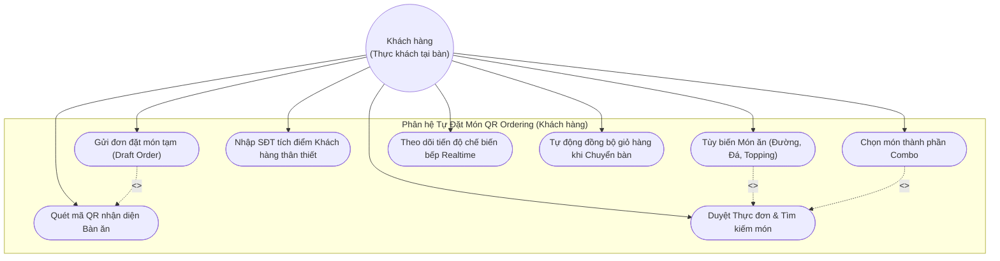
```mermaid
flowchart TD
    Customer(("Khách hàng<br/>(Thực khách tại bàn)"))

    subgraph QrSubsystem ["Phân hệ Tự Đặt Món QR Ordering (Khách hàng)"]
        UC_Q1(["Quét mã QR nhận diện Bàn ăn"])
        UC_Q2(["Duyệt Thực đơn & Tìm kiếm món"])
        UC_Q3(["Tùy biến Món ăn (Đường, Đá, Topping)"])
        UC_Q4(["Chọn món thành phần Combo"])
        UC_Q5(["Nhập SĐT tích điểm Khách hàng thân thiết"])
        UC_Q6(["Gửi đơn đặt món tạm (Draft Order)"])
        UC_Q7(["Theo dõi tiến độ chế biến bếp Realtime"])
        UC_Q8(["Tự động đồng bộ giỏ hàng khi Chuyển bàn"])
    end

    Customer --> UC_Q1
    Customer --> UC_Q2
    Customer --> UC_Q3
    Customer --> UC_Q4
    Customer --> UC_Q5
    Customer --> UC_Q6
    Customer --> UC_Q7
    Customer --> UC_Q8

    UC_Q3 -.->|<<extend>>| UC_Q2
    UC_Q4 -.->|<<extend>>| UC_Q2
    UC_Q6 -.->|<<include>>| UC_Q1
```

---

## 21. Biểu đồ Use Case Phân rã - Phân hệ Bán hàng POS (Cashier)
```mermaid
flowchart TD
    Cashier(("Nhân viên Thu ngân<br/>(Quầy POS)"))

    subgraph PosSubsystem ["Phân hệ Điểm Bán Hàng & Quản trị Sảnh (POS)"]
        UC_P1(["Mở ca thu ngân & Khai báo tiền két"])
        UC_P2(["Quản lý sơ đồ bàn (Mở, Gộp, Chuyển bàn)"])
        UC_P3(["Tiếp nhận & Phê duyệt đơn QR Ordering"])
        UC_P4(["Lập đơn trực tiếp tại bàn & Đơn mang đi"])
        UC_P5(["Điều chỉnh giỏ hàng, ghi chú & Giảm giá"])
        UC_P6(["In phiếu tạm tính tiền khổ K80"])
        UC_P7(["Khởi tạo thanh toán VietQR động Napas 247"])
        UC_P8(["Thu tiền mặt & Tính tiền thừa tự động"])
        UC_P9(["Thực hiện Nạp/Rút tiền két (Till In/Out)"])
        UC_P10(["Đóng ca làm việc & In báo cáo Z-Report"])
    end

    Cashier --> UC_P1
    Cashier --> UC_P2
    Cashier --> UC_P3
    Cashier --> UC_P4
    Cashier --> UC_P5
    Cashier --> UC_P6
    Cashier --> UC_P7
    Cashier --> UC_P8
    Cashier --> UC_P9
    Cashier --> UC_P10

    UC_P7 -.->|<<extend>>| UC_P6
    UC_P8 -.->|<<extend>>| UC_P6
```

---

## 22. Biểu đồ Use Case Phân rã - Phân hệ Điều phối Nhà bếp KDS (Chef)
```mermaid
flowchart TD
    Chef(("Đầu bếp / Nhân viên bếp<br/>(Kitchen Crew)"))

    subgraph KdsSubsystem ["Phân hệ Điều Phối Nhà Bếp Thời Gian Thực (KDS)"]
        UC_K1(["Lựa chọn Trạm chế biến chuyên môn (Station)"])
        UC_K2(["Tiếp nhận Vé món điện tử tức thời (Ticket)"])
        UC_K3(["Theo dõi đồng hồ cảnh báo quá hạn SLA (10p/15p)"])
        UC_K4(["Cập nhật tiến độ: Nhận nấu (Processing)"])
        UC_K5(["Cập nhật tiến độ: Nấu xong (Done / Ready)"])
        UC_K6(["Bật/Tắt trạng thái Hết món tức thời (Sold-out)"])
        UC_K7(["Yêu cầu Hủy món đang nấu (Cần mã PIN)"])
        UC_K8(["Kích hoạt trừ kho nguyên vật liệu BOM tự động"])
    end

    Chef --> UC_K1
    Chef --> UC_K2
    Chef --> UC_K3
    Chef --> UC_K4
    Chef --> UC_K5
    Chef --> UC_K6
    Chef --> UC_K7
    
    UC_K5 -.->|<<include>>| UC_K8
```

---

## 23. Biểu đồ Use Case Phân rã - Phân hệ Quản trị Hậu sảnh BOH Admin (Manager/Admin)
```mermaid
flowchart TD
    Admin(("Quản lý / Quản trị viên / Thủ kho<br/>(BOH Management)"))

    subgraph AdminSubsystem ["Phân hệ Quản Trị Hậu Sảnh & Kiểm Soát (BOH Admin)"]
        UC_A1(["Quản lý Thực đơn, Món ăn & Topping"])
        UC_A2(["Thiết lập Công thức Định mức BOM (Recipe)"])
        UC_A3(["Quản lý Danh mục Nguyên vật liệu & Tồn kho"])
        UC_A4(["Lập Phiếu Nhập kho & Nhà cung cấp"])
        UC_A5(["Tạo Đợt kiểm kê & Cân bằng tồn kho thực tế"])
        UC_A6(["Phê duyệt Yêu cầu Hủy món/Hủy đơn nhạy cảm"])
        UC_A7(["Đối soát Giao dịch Webhook VietQR SePay"])
        UC_A8(["Quản lý Ca làm việc, Nhân viên & Phân quyền RBAC"])
        UC_A9(["Xem Báo cáo Doanh thu & Chi phí Hao hụt"])
    end

    Admin --> UC_A1
    Admin --> UC_A2
    Admin --> UC_A3
    Admin --> UC_A4
    Admin --> UC_A5
    Admin --> UC_A6
    Admin --> UC_A7
    Admin --> UC_A8
    Admin --> UC_A9
```

---

## 24. Biểu đồ Lớp (Class Diagram) - Phân hệ Đơn hàng & Thanh toán
```mermaid
classDiagram
    class Order {
        +int Id
        +string OrderNumber
        +int? TableId
        +OrderStatus Status
        +decimal SubTotal
        +decimal DiscountAmount
        +decimal TaxAmount
        +decimal TotalAmount
        +byte[] RowVersion
        +DateTime CreatedAt
        +AddItem(menuItemId, qty, unitPrice)
        +CancelOrder(reason, managerPin)
        +MarkAsPaid()
    }

    class OrderItem {
        +int Id
        +int OrderId
        +int MenuItemId
        +int Quantity
        +decimal UnitPrice
        +decimal TotalPrice
        +KitchenStatus Status
        +string Notes
        +UpdateStatus(newStatus)
        +VoidItem(reason, wasteCharge)
    }

    class OrderItemModifier {
        +int Id
        +int OrderItemId
        +int ModifierOptionId
        +string OptionName
        +decimal ExtraPrice
    }

    class Payment {
        +int Id
        +int OrderId
        +PaymentMethod Method
        +decimal Amount
        +PaymentStatus Status
        +string TransactionRef
        +DateTime CreatedAt
        +ProcessCash(tendered, change)
        +ProcessVietQR(transactionRef)
    }

    class SepayWebhookLog {
        +int Id
        +int SepayTransactionId
        +string Gateway
        +decimal TransferAmount
        +string Content
        +string ReferenceCode
        +bool IsProcessed
        +ValidateIdempotency()
    }

    class VoidLog {
        +int Id
        +int OrderItemId
        +int StaffId
        +int? ApprovedBy
        +string Reason
        +decimal LossAmount
        +DateTime CreatedAt
    }

    Order "1" *-- "1..*" OrderItem : Chứa các dòng món
    OrderItem "1" *-- "0..*" OrderItemModifier : Có các tùy chọn
    Order "1" *-- "0..*" Payment : Thực hiện thanh toán
    Payment "0..1" --> "0..1" SepayWebhookLog : Khớp webhook
    OrderItem "1" --> "0..1" VoidLog : Lưu vết hủy món
```

---

## 25. Biểu đồ Lớp (Class Diagram) - Phân hệ Thực đơn & Tùy chọn Modifier
```mermaid
classDiagram
    class Category {
        +int Id
        +string Name
        +string Code
        +int DisplayOrder
        +bool IsActive
    }

    class MenuItem {
        +int Id
        +int CategoryId
        +string Name
        +string Code
        +decimal BasePrice
        +string ImageUrl
        +bool IsAvailable
        +bool IsSoldOut
        +bool IsCombo
        +ToggleSoldOut(status)
    }

    class ModifierGroup {
        +int Id
        +string Name
        +int MinSelections
        +int MaxSelections
        +bool IsRequired
    }

    class ModifierOption {
        +int Id
        +int ModifierGroupId
        +string Name
        +decimal ExtraPrice
        +bool IsDefault
    }

    class MenuItemModifierGroup {
        +int MenuItemId
        +int ModifierGroupId
    }

    class ComboItem {
        +int Id
        +int ComboMenuItemId
        +int GroupId
        +int AllowedMenuItemId
        +int Quantity
    }

    Category "1" *-- "0..*" MenuItem : Phân loại
    MenuItem "1" *-- "0..*" MenuItemModifierGroup : Liên kết
    ModifierGroup "1" *-- "0..*" MenuItemModifierGroup : Thuộc về
    ModifierGroup "1" *-- "1..*" ModifierOption : Bao gồm các lựa chọn
    MenuItem "1" *-- "0..*" ComboItem : Chứa món thành phần
```

---

## 26. Biểu đồ Lớp (Class Diagram) - Phân hệ Kho hàng & Định mức BOM
```mermaid
classDiagram
    class Material {
        +int Id
        +string Name
        +string Code
        +int BaseUnitId
        +decimal CurrentStock
        +decimal MinStockLevel
        +decimal CostPrice
        +DeductStock(quantity)
        +ReplenishStock(quantity)
    }

    class BaseUnit {
        +int Id
        +string Name
        +string Symbol
    }

    class Recipe {
        +int Id
        +int MenuItemId
        +string Description
        +bool IsActive
    }

    class RecipeItem {
        +int Id
        +int RecipeId
        +int MaterialId
        +decimal QuantityNeeded
        +decimal WastePercentage
    }

    class InventoryTransaction {
        +int Id
        +int MaterialId
        +TransactionType Type
        +decimal QuantityChange
        +decimal RemainingStock
        +string ReferenceNumber
        +DateTime CreatedAt
    }

    class Stocktake {
        +int Id
        +string Code
        +StocktakeStatus Status
        +int CreatedByStaffId
        +DateTime CreatedAt
        +CompleteAndBalanceStock()
    }

    class StocktakeItem {
        +int Id
        +int StocktakeId
        +int MaterialId
        +decimal SystemStock
        +decimal ActualStock
        +decimal Discrepancy
        +string Notes
    }

    Material "1" --> "1" BaseUnit : Đơn vị tính cơ sở
    MenuItem "1" *-- "0..1" Recipe : Công thức định mức BOM
    Recipe "1" *-- "1..*" RecipeItem : Chi tiết tiêu hao
    Material "1" <-- "1..*" RecipeItem : Sử dụng nguyên liệu
    Material "1" *-- "0..*" InventoryTransaction : Lịch sử biến động
    Stocktake "1" *-- "1..*" StocktakeItem : Dòng kiểm đếm
    Material "1" <-- "1..*" StocktakeItem : Kiểm kê vật tư
```

---

## 27. Biểu đồ Lớp (Class Diagram) - Phân hệ Ca làm việc & Tiền két
```mermaid
classDiagram
    class Shift {
        +int Id
        +int StaffId
        +DateTime OpenTime
        +DateTime? CloseTime
        +decimal OpeningBalance
        +decimal? ClosingCashActual
        +decimal ExpectedCash
        +ShiftStatus Status
        +RecordCashMovement(type, amount, note)
        +CloseShift(actualCash)
    }

    class CashMovement {
        +int Id
        +int ShiftId
        +CashMovementType Type
        +decimal Amount
        +string Reason
        +int? ApprovedBy
        +DateTime CreatedAt
    }

    class User {
        +int Id
        +string Username
        +string PasswordHash
        +string FullName
        +string PinHash
        +int FailedPinAttempts
        +DateTime? PinLockoutUntil
        +bool IsActive
        +VerifyPin(pin)
        +ResetPinLockout()
    }

    class Role {
        +int Id
        +string Name
        +string Code
        +string Permissions
    }

    class Table {
        +int Id
        +int AreaId
        +string TableNumber
        +int Capacity
        +TableStatus Status
        +string QrToken
        +UpdateStatus(newStatus)
        +RegenerateQrToken()
    }

    class Area {
        +int Id
        +string Name
        +int Floor
        +bool IsActive
    }

    Shift "1" *-- "0..*" CashMovement : Các khoản nạp/rút trong ca
    User "1" *-- "0..*" Shift : Thu ngân phụ trách ca
    User "1" --> "1..*" Role : Gán vai trò quyền hạn
    Area "1" *-- "1..*" Table : Không gian sảnh
```
