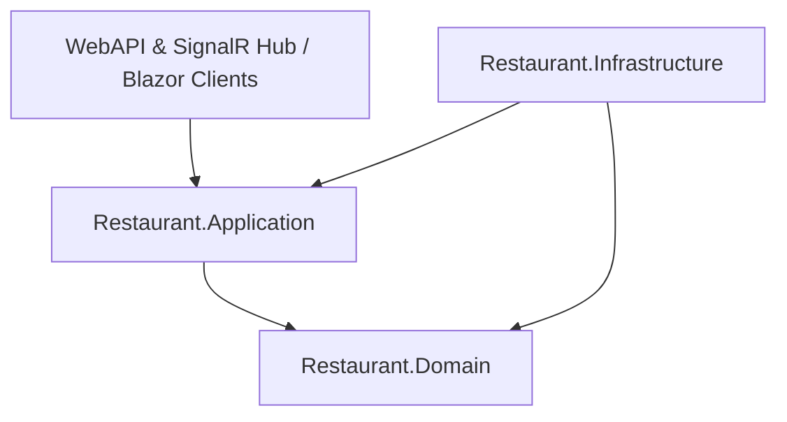
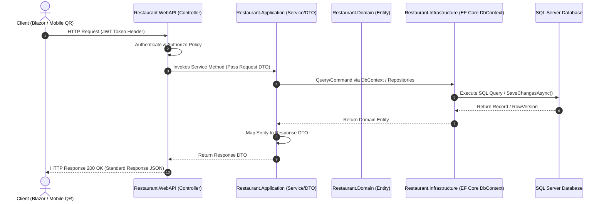

# Kiến trúc Kỹ thuật (ARCHITECTURE.md)

> **Hệ thống:** Restaurant POS & KDS System  
> **Phong cách Kiến trúc:** Clean Architecture (Onion Architecture) + Domain Event Driven  
> **Thời gian cập nhật:** 2026-07-23  

---

## 📌 1. Tổng quan Kiến trúc Hệ thống

Hệ thống được thiết kế dựa trên các nguyên lý **SOLID**, áp dụng mô hình **Clean Architecture** để phân tách trách nhiệm giữa các tầng (Layers). Đảm bảo logic nghiệp vụ hạt nhân độc lập hoàn toàn với framework, cơ sở dữ liệu và các giao diện người dùng.

---

## 📌 2. Phân tích chi tiết các Tầng (Layered Architecture)

### 2.1. Tầng Domain (`Restaurant.Domain`)
- **Vị trí:** Vùng lõi trung tâm của hệ thống (Core).
- **Phụ thuộc:** Không phụ thuộc vào bất kỳ framework hay thư viện bên ngoài nào ngoại trừ C# Standard Libraries.
- **Thành phần:**
  - **Entities:** `User`, `Role`, `Area`, `Table`, `Category`, `MenuItem`, `ModifierGroup`, `ModifierOption`, `Order`, `OrderItem`, `Payment`, `Shift`, `Material`, `Recipe`, `GoodsReceipt`, `Stocktake`, `Customer`, `LoyaltyTransaction`...
  - **Common / Base:** `BaseEntity`, `AuditableEntity`, `FullAuditableEntity`, `IHasRowVersion`.
  - **Interfaces Domain:** `IRowVersion`.

### 2.2. Tầng Application (`Restaurant.Application`)
- **Vị trí:** Chứa toàn bộ các Use Case và quy trình logic nghiệp vụ ứng dụng.
- **Phụ thuộc:** Phụ thuộc trực tiếp vào `Restaurant.Domain`.
- **Thành phần:**
  - **Interfaces:** `IIdentityService`, `ICategoryService`, `IMenuItemService`, `IModifierService`, `IAreaService`, `ITableService`, `IKitchenService`, `ICurrentUserService`, `IRestaurantHubClient`.
  - **DTOs:** Request/Response Models (`AuthDtos`, `MenuDtos`, `TableDtos`, `KitchenDtos`).
  - **Domain Events / Handlers:** Xử lý các sự kiện nghiệp vụ liên kết giữa các Bounded Contexts (ví dụ: `OrderItemKitchenDoneDomainEvent`).

### 2.3. Tầng Infrastructure (`Restaurant.Infrastructure`)
- **Vị trí:** Cung cấp các hiện thực giao tiếp với môi trường ngoài (Database, SignalR Hub, External APIs, System Clock).
- **Phụ thuộc:** Phụ thuộc vào `Restaurant.Application` và `Restaurant.Domain`.
- **Thành phần:**
  - **Persistence:** `ApplicationDbContext`, Entity Fluent API Configurations (`Configurations/`), Interceptors (`AuditableEntityInterceptor`).
  - **Services Implementation:** `IdentityService`, `CategoryService`, `MenuItemService`, `ModifierService`, `AreaService`, `TableService`, `KitchenService`, `QrCodeService`, `CurrentUserService`.
  - **Realtime Infrastructure:** `RestaurantHub` (`Hubs/RestaurantHub.cs`).
  - **Background Jobs:** `KitchenSlaMonitoringWorker` (Background service theo dõi trễ món SLA).

### 2.4. Tầng Presentation / WebAPI (`Restaurant.WebAPI`)
- **Vị trí:** Cung cấp cổng giao tiếp RESTful API và SignalR Realtime Hub cho các Web Clients.
- **Phụ thuộc:** Phụ thuộc vào `Restaurant.Application` và `Restaurant.Infrastructure`.
- **Thành phần:**
  - **Controllers:** `AuthController`, `CategoriesController`, `MenuItemsController`, `ModifiersController`, `AreasController`, `TablesController`, `KdsController`.
  - **Middleware & Filters:** Exception handling, Authentication/Authorization Middleware, Rate Limiting filter.
  - **Configuration:** `Program.cs` cấu hình Dependency Injection, JWT Bearer Auth, SignalR Hub Routing (`/hubs/restaurant`).

---

## 📌 3. Sơ đồ Luồng Truyền dữ liệu (Data & Execution Flow)

---

## 📌 4. Cơ chế Đảm bảo An toàn Dữ liệu & Concurrency Control

### 4.1. RowVersion & Optimistic Concurrency
Các thực thể core nhạy cảm với dữ liệu như `Order`, `Table`, `Shift`, `Material` đều kế thừa interface `IHasRowVersion` và được EF Core cấu hình `IsRowVersion()` (cột `byte[] RowVersion` trên SQL Server).
- Khi hai thao tác đồng thời ghi dữ liệu (ví dụ: Thu ngân duyệt đơn QR cùng lúc khách hủy đơn trên web), EF Core ném ra `DbUpdateConcurrencyException`.
- Hệ thống tự động rollback transaction và thông báo lỗi tới người dùng để tải lại dữ liệu mới nhất.

### 4.2. Soft Delete & Global Query Filter
Mọi bản ghi bị xóa sẽ không bị xóa vật lý khỏi DB mà được gán `IsDeleted = true` và `DeletedAt = DateTime.UtcNow`. Tầng DbContext tự động áp dụng Global Query Filter `!e.IsDeleted` trên tất cả các câu truy vấn để bảo vệ tính toàn vẹn dữ liệu báo cáo lịch sử.

---

## 📌 5. Quy trình Quản lý Đa ngôn ngữ (i18n & Localization Strategy)

Hệ thống tuân thủ nghiêm ngặt quy tắc **Không Hardcode Chuỗi Văn Bản (No Hardtext)** ở cả Backend và Frontend.

### 5.1. Backend Localization (.NET 9.0 WebAPI)
- **Middleware:** `AddLocalization()` & `RequestLocalizationOptions` hỗ trợ xác định Culture dựa trên HTTP Header `Accept-Language` (mặc định `vi` - Tiếng Việt, hỗ trợ `en` - Tiếng Anh).
- **Resource Files:** Tầng `Restaurant.Application/Resources/` chứa các file định nghĩa chuỗi đa ngôn ngữ:
  - `SharedResources.vi.resx` (Tiếng Việt)
  - `SharedResources.en.resx` (Tiếng Anh)
- **Quy trình thêm từ khóa mới ở Backend:**
  1. Thêm key mã lỗi/thông báo dạng `UPPER_SNAKE_CASE` (ví dụ: `INVALID_QR_TOKEN`, `TABLE_IS_BILLING`) vào file `SharedResources.vi.resx` và `SharedResources.en.resx`.
  2. Inject `IStringLocalizer<SharedResources> _localizer` trong Service hoặc Controller.
  3. Lấy thông báo theo culture: `_localizer["INVALID_QR_TOKEN"]`.

### 5.2. Frontend Localization (Blazor Web Clients)
- **Static i18n JSON:** Thư mục `wwwroot/i18n/` chứa các file từ điển giao diện:
  - `vi.json` (Tiếng Việt)
  - `en.json` (Tiếng Anh)
- **Quy trình thêm key giao diện mới ở Frontend:**
  1. Thêm key dạng `Pascal_Snake` (ví dụ: `Btn_Submit`, `Status_Pending`) vào cả 2 file `vi.json` và `en.json`.
  2. Binding trên Blazor UI component thông qua i18n Localizer: `@L["Btn_Submit"]`.

