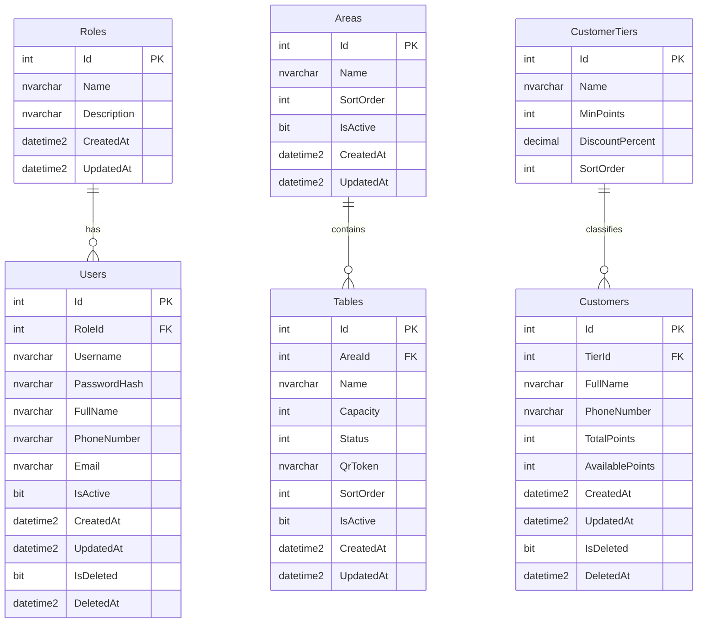
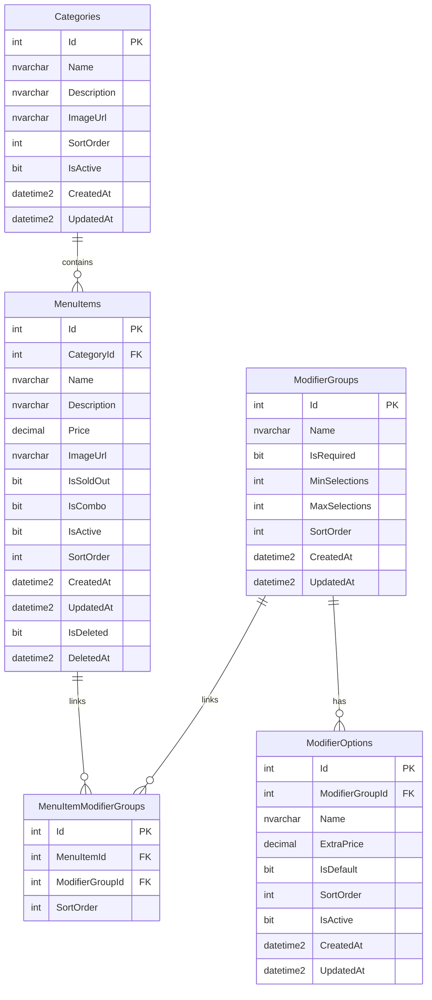
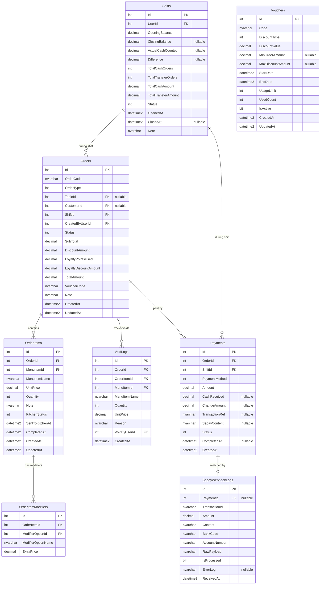
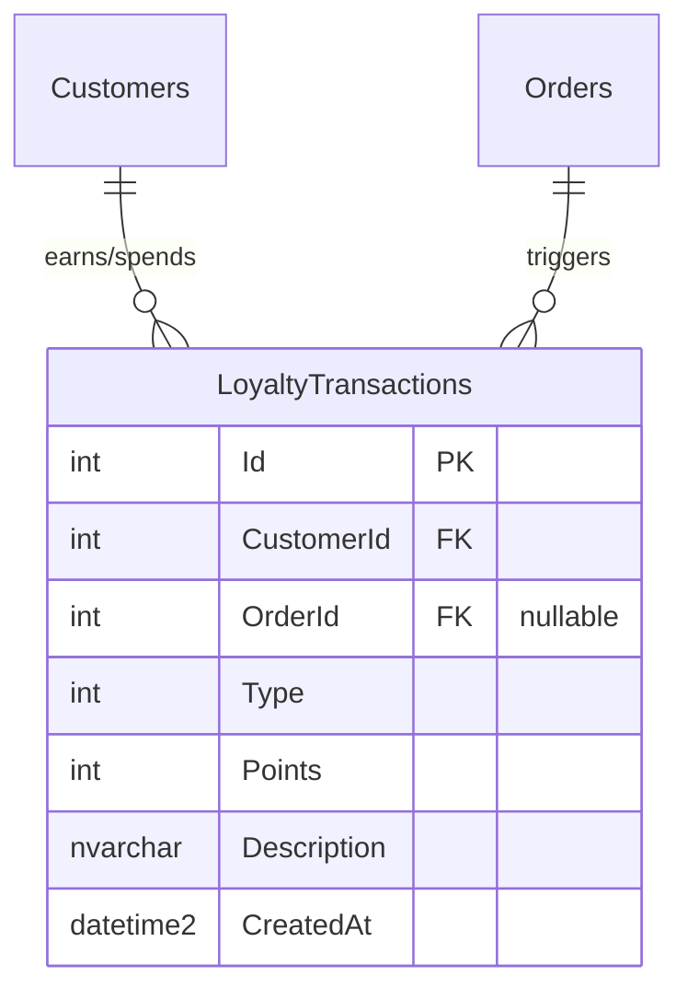
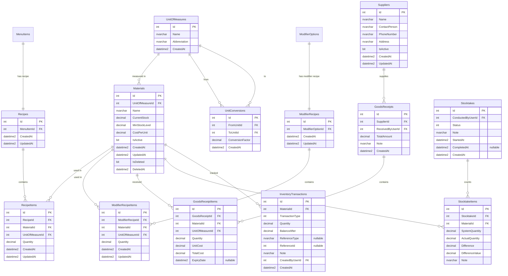
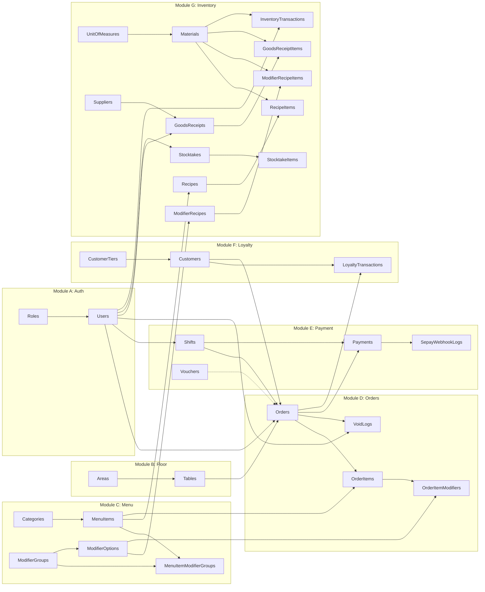

# Thiết kế Cơ sở Dữ liệu - Hệ thống Quản lý Nhà hàng Full Web

> **Công nghệ:** SQL Server + Entity Framework Core 9.0  
> **Quy tắc đặt tên:** Tuân thủ [Database Convention](file:///d:/My%20Project/rules/05-database/database-convention.md)  
> — Tables: PascalCase, Plural | Columns: PascalCase | PK: `Id` | FK: `[SingularTableName]Id`  
> — Soft Delete: `IsDeleted`, `DeletedAt` | Audit: `CreatedAt`, `UpdatedAt`

---

## 1. Tổng quan Kiến trúc Dữ liệu

Hệ thống được chia thành **7 nhóm bảng (Module)** phản ánh trực tiếp các phân hệ chức năng:

| # | Module | Bảng | Mô tả |
|---|--------|------|--------|
| A | Xác thực & Phân quyền | Roles, Users | Quản lý nhân viên và RBAC |
| B | Sơ đồ Sảnh & Bàn | Areas, Tables | Quản lý khu vực, bàn ăn, trạng thái bàn, mã QR |
| C | Thực đơn & Tuỳ chọn | Categories, MenuItems, ModifierGroups, ModifierOptions, MenuItemModifierGroups | Quản lý menu, danh mục, options, combo |
| D | Đơn hàng & KDS | Orders, OrderItems, OrderItemModifiers, VoidLogs | Xử lý đơn hàng, trạng thái bếp, hủy món |
| E | Thanh toán & Kết ca | Payments, SepayWebhookLogs, Shifts, Vouchers | Tài chính, VietQR, SePay, ca làm việc |
| F | Khách hàng & Loyalty | Customers, CustomerTiers, LoyaltyTransactions | Thành viên, tích/tiêu điểm |
| G | Kho & Nguyên liệu (BOM) | Materials, UnitOfMeasures, UnitConversions, Recipes, RecipeItems, ModifierRecipes, ModifierRecipeItems, Suppliers, GoodsReceipts, GoodsReceiptItems, Stocktakes, StocktakeItems, InventoryTransactions | Định lượng (BOM) cho món ăn và modifier, nhập kho, kiểm kê, trừ kho |

**Tổng: 29 bảng**

---

## 2. Sơ đồ Quan hệ Thực thể (ER Diagram)

### 2.1. Module A + B + F: Nhân viên, Sảnh & Khách hàng



### 2.2. Module C: Thực đơn & Tuỳ chọn (Bao gồm Combo)



### 2.3. Module D + E: Đơn hàng, Thanh toán & Ca làm việc



### 2.4. Module F: Loyalty



### 2.5. Module G: Kho & Định lượng (BOM) cho Món ăn và Modifier/Topping



---

## 3. Định nghĩa Chi tiết Bảng (Table Definitions)

---

### Module A: Xác thực & Phân quyền

#### Bảng `Roles`
Lưu trữ các vai trò cố định trong hệ thống.

| Cột | Kiểu | Ràng buộc | Mô tả |
|-----|------|-----------|-------|
| `Id` | `int` | PK, Identity | Mã vai trò |
| `Name` | `nvarchar(50)` | NOT NULL, UNIQUE | Tên vai trò (Admin, Manager, Cashier, Chef) |
| `Description` | `nvarchar(200)` | NULL | Mô tả chi tiết |
| `CreatedAt` | `datetime2` | NOT NULL, DEFAULT GETUTCDATE() | Thời điểm tạo |
| `UpdatedAt` | `datetime2` | NULL | Thời điểm cập nhật |

**Dữ liệu Seed:**

| Id | Name | Description |
|----|------|-------------|
| 1 | Admin | Chủ nhà hàng – quyền cao nhất |
| 2 | Manager | Quản lý sảnh – quản trị menu, sơ đồ bàn, kiểm kê |
| 3 | Cashier | Thu ngân – POS, thanh toán, kết ca |
| 4 | Chef | Bếp – chỉ thao tác trên màn hình KDS |

---

#### Bảng `Users`
Tài khoản nhân viên đăng nhập hệ thống.

| Cột | Kiểu | Ràng buộc | Mô tả |
|-----|------|-----------|-------|
| `Id` | `int` | PK, Identity | Mã nhân viên |
| `RoleId` | `int` | FK → Roles.Id, NOT NULL | Vai trò |
| `Username` | `nvarchar(50)` | NOT NULL, UNIQUE | Tên đăng nhập |
| `PasswordHash` | `nvarchar(256)` | NOT NULL | Mật khẩu đã hash (BCrypt) |
| `FullName` | `nvarchar(100)` | NOT NULL | Họ và tên |
| `PhoneNumber` | `nvarchar(15)` | NULL | Số điện thoại |
| `Email` | `nvarchar(100)` | NULL | Email |
| `IsActive` | `bit` | NOT NULL, DEFAULT 1 | Trạng thái hoạt động |
| `CreatedAt` | `datetime2` | NOT NULL, DEFAULT GETUTCDATE() | Thời điểm tạo |
| `UpdatedAt` | `datetime2` | NULL | Thời điểm cập nhật |
| `IsDeleted` | `bit` | NOT NULL, DEFAULT 0 | Cờ soft delete |
| `DeletedAt` | `datetime2` | NULL | Thời điểm xoá mềm |

**Index:** `IX_Users_Username` (Unique), `IX_Users_RoleId`

---

### Module B: Sơ đồ Sảnh & Bàn

#### Bảng `Areas`
Khu vực sảnh nhà hàng (Tầng 1, Tầng 2, Ngoài trời...).

| Cột | Kiểu | Ràng buộc | Mô tả |
|-----|------|-----------|-------|
| `Id` | `int` | PK, Identity | Mã khu vực |
| `Name` | `nvarchar(100)` | NOT NULL | Tên khu vực |
| `SortOrder` | `int` | NOT NULL, DEFAULT 0 | Thứ tự hiển thị |
| `IsActive` | `bit` | NOT NULL, DEFAULT 1 | Trạng thái hoạt động |
| `CreatedAt` | `datetime2` | NOT NULL, DEFAULT GETUTCDATE() | Thời điểm tạo |
| `UpdatedAt` | `datetime2` | NULL | Thời điểm cập nhật |

---

#### Bảng `Tables`
Bàn ăn trong nhà hàng với trạng thái realtime và mã QR.

| Cột | Kiểu | Ràng buộc | Mô tả |
|-----|------|-----------|-------|
| `Id` | `int` | PK, Identity | Mã bàn |
| `AreaId` | `int` | FK → Areas.Id, NOT NULL | Khu vực chứa bàn |
| `Name` | `nvarchar(50)` | NOT NULL | Tên/Số bàn hiển thị (B01, B02...) |
| `Capacity` | `int` | NOT NULL, DEFAULT 4 | Sức chứa (số ghế) |
| `Status` | `int` | NOT NULL, DEFAULT 0 | Trạng thái bàn (enum — xem Mục 4) |
| `QrToken` | `nvarchar(100)` | NOT NULL, UNIQUE | Token bảo mật cho mã QR bàn |
| `SortOrder` | `int` | NOT NULL, DEFAULT 0 | Thứ tự hiển thị |
| `IsActive` | `bit` | NOT NULL, DEFAULT 1 | Trạng thái hoạt động |
| `RowVersion` | `rowversion` | NOT NULL | Timestamp chống xung đột Concurrency |
| `CreatedAt` | `datetime2` | NOT NULL, DEFAULT GETUTCDATE() | Thời điểm tạo |
| `UpdatedAt` | `datetime2` | NULL | Thời điểm cập nhật |

**Index:** `IX_Tables_AreaId`, `IX_Tables_QrToken` (Unique), `IX_Tables_Status`

---

### Module C: Thực đơn & Tuỳ chọn (Hỗ trợ Combo)

#### Bảng `Categories`
Danh mục phân loại món ăn (Đồ ăn, Thức uống, Tráng miệng...).

| Cột | Kiểu | Ràng buộc | Mô tả |
|-----|------|-----------|-------|
| `Id` | `int` | PK, Identity | Mã danh mục |
| `Name` | `nvarchar(100)` | NOT NULL | Tên danh mục |
| `Description` | `nvarchar(500)` | NULL | Mô tả danh mục |
| `ImageUrl` | `nvarchar(500)` | NULL | Đường dẫn ảnh đại diện |
| `SortOrder` | `int` | NOT NULL, DEFAULT 0 | Thứ tự hiển thị trên menu |
| `IsActive` | `bit` | NOT NULL, DEFAULT 1 | Trạng thái hoạt động |
| `CreatedAt` | `datetime2` | NOT NULL, DEFAULT GETUTCDATE() | Thời điểm tạo |
| `UpdatedAt` | `datetime2` | NULL | Thời điểm cập nhật |

---

#### Bảng `MenuItems`
Danh sách món ăn, thức uống bán trên hệ thống (bao gồm combo).

| Cột | Kiểu | Ràng buộc | Mô tả |
|-----|------|-----------|-------|
| `Id` | `int` | PK, Identity | Mã món ăn |
| `CategoryId` | `int` | FK → Categories.Id, NOT NULL | Danh mục chứa món |
| `Name` | `nvarchar(150)` | NOT NULL | Tên món ăn |
| `Description` | `nvarchar(500)` | NULL | Mô tả món ăn |
| `Price` | `decimal(18,2)` | NOT NULL | Giá bán (VNĐ) |
| `ImageUrl` | `nvarchar(500)` | NULL | Đường dẫn ảnh món ăn |
| `IsSoldOut` | `bit` | NOT NULL, DEFAULT 0 | Trạng thái hết món (bếp báo) |
| `IsCombo` | `bit` | NOT NULL, DEFAULT 0 | Đánh dấu là Combo món ăn |
| `IsActive` | `bit` | NOT NULL, DEFAULT 1 | Có hiển thị trên menu |
| `SortOrder` | `int` | NOT NULL, DEFAULT 0 | Thứ tự hiển thị trong danh mục |
| `CreatedAt` | `datetime2` | NOT NULL, DEFAULT GETUTCDATE() | Thời điểm tạo |
| `UpdatedAt` | `datetime2` | NULL | Thời điểm cập nhật |
| `IsDeleted` | `bit` | NOT NULL, DEFAULT 0 | Cờ soft delete |
| `DeletedAt` | `datetime2` | NULL | Thời điểm xoá mềm |

**Index:** `IX_MenuItems_CategoryId`, `IX_MenuItems_IsSoldOut`, `IX_MenuItems_IsCombo`

---

#### Bảng `ModifierGroups`
Nhóm tuỳ chọn đi kèm món ăn (ví dụ: "Chọn Size", "Chọn lượng đường", hoặc các nhóm lựa chọn món thành phần của Combo như "Chọn món chính").

| Cột | Kiểu | Ràng buộc | Mô tả |
|-----|------|-----------|-------|
| `Id` | `int` | PK, Identity | Mã nhóm |
| `Name` | `nvarchar(100)` | NOT NULL | Tên nhóm (Size, Đường, Đá, Topping, Lựa chọn món...) |
| `IsRequired` | `bit` | NOT NULL, DEFAULT 0 | Bắt buộc phải chọn? |
| `MinSelections` | `int` | NOT NULL, DEFAULT 0 | Số lượng chọn tối thiểu |
| `MaxSelections` | `int` | NOT NULL, DEFAULT 1 | Số lượng chọn tối đa |
| `SortOrder` | `int` | NOT NULL, DEFAULT 0 | Thứ tự hiển thị |
| `CreatedAt` | `datetime2` | NOT NULL, DEFAULT GETUTCDATE() | Thời điểm tạo |
| `UpdatedAt` | `datetime2` | NULL | Thời điểm cập nhật |

---

#### Bảng `ModifierOptions`
Các lựa chọn cụ thể trong một nhóm tuỳ chọn (ví dụ: Size M, Thêm trân châu, hoặc các món ăn được lựa chọn trong Combo như "Burger Gà").

| Cột | Kiểu | Ràng buộc | Mô tả |
|-----|------|-----------|-------|
| `Id` | `int` | PK, Identity | Mã lựa chọn |
| `ModifierGroupId` | `int` | FK → ModifierGroups.Id, NOT NULL | Nhóm tuỳ chọn |
| `Name` | `nvarchar(100)` | NOT NULL | Tên lựa chọn (Size M, Ít đường, Topping Trân châu, Hamburger...) |
| `ExtraPrice` | `decimal(18,2)` | NOT NULL, DEFAULT 0 | Giá cộng thêm (VNĐ) |
| `IsDefault` | `bit` | NOT NULL, DEFAULT 0 | Tuỳ chọn mặc định |
| `SortOrder` | `int` | NOT NULL, DEFAULT 0 | Thứ tự hiển thị |
| `IsActive` | `bit` | NOT NULL, DEFAULT 1 | Trạng thái hoạt động |
| `CreatedAt` | `datetime2` | NOT NULL, DEFAULT GETUTCDATE() | Thời điểm tạo |
| `UpdatedAt` | `datetime2` | NULL | Thời điểm cập nhật |

**Index:** `IX_ModifierOptions_ModifierGroupId`

---

#### Bảng `MenuItemModifierGroups`
Liên kết many-to-many giữa MenuItems và ModifierGroups (món nào có nhóm tuỳ chọn nào).

| Cột | Kiểu | Ràng buộc | Mô tả |
|-----|------|-----------|-------|
| `Id` | `int` | PK, Identity | Mã liên kết |
| `MenuItemId` | `int` | FK → MenuItems.Id, NOT NULL | Món ăn |
| `ModifierGroupId` | `int` | FK → ModifierGroups.Id, NOT NULL | Nhóm tuỳ chọn |
| `SortOrder` | `int` | NOT NULL, DEFAULT 0 | Thứ tự hiển thị trên giao diện gọi món |

**Index:** `IX_MenuItemModifierGroups_MenuItemId`, `UQ_MenuItemModifierGroups_MenuItemId_ModifierGroupId` (Unique Composite)

---

### Module D: Đơn hàng & KDS

#### Bảng `Orders`
Đơn hàng chính — trung tâm dữ liệu của toàn hệ thống.

| Cột | Kiểu | Ràng buộc | Mô tả |
|-----|------|-----------|-------|
| `Id` | `int` | PK, Identity | Mã đơn hàng |
| `OrderCode` | `nvarchar(20)` | NOT NULL, UNIQUE | Mã đơn hàng hiển thị (ORD-20260714-001) |
| `OrderType` | `int` | NOT NULL | Loại đơn: 0 = DineIn, 1 = Pickup |
| `TableId` | `int` | FK → Tables.Id, NULL | Bàn ăn (NULL nếu đơn Pickup) |
| `CustomerId` | `int` | FK → Customers.Id, NULL | Khách hàng thành viên (nếu tích điểm) |
| `ShiftId` | `int` | FK → Shifts.Id, NOT NULL | Ca làm việc tạo đơn |
| `CreatedByUserId` | `int` | FK → Users.Id, NOT NULL | Nhân viên tạo đơn (thu ngân hoặc hệ thống từ QR) |
| `Status` | `int` | NOT NULL, DEFAULT 0 | Trạng thái đơn (enum — xem Mục 4) |
| `SubTotal` | `decimal(18,2)` | NOT NULL, DEFAULT 0 | Tổng tiền trước giảm giá |
| `DiscountAmount` | `decimal(18,2)` | NOT NULL, DEFAULT 0 | Số tiền giảm từ voucher |
| `LoyaltyPointsUsed` | `int` | NOT NULL, DEFAULT 0 | Số điểm loyalty đã dùng |
| `LoyaltyDiscountAmount` | `decimal(18,2)` | NOT NULL, DEFAULT 0 | Số tiền giảm từ tiêu điểm |
| `TotalAmount` | `decimal(18,2)` | NOT NULL, DEFAULT 0 | Số tiền khách phải trả sau giảm giá |
| `VoucherCode` | `nvarchar(50)` | NULL | Mã voucher áp dụng (nếu có) |
| `Note` | `nvarchar(500)` | NULL | Ghi chú đơn hàng |
| `RowVersion` | `rowversion` | NOT NULL | Timestamp chống xung đột Concurrency |
| `CreatedAt` | `datetime2` | NOT NULL, DEFAULT GETUTCDATE() | Thời điểm tạo đơn |
| `UpdatedAt` | `datetime2` | NULL | Thời điểm cập nhật cuối |

**Index:** `IX_Orders_OrderCode` (Unique), `IX_Orders_TableId`, `IX_Orders_ShiftId`, `IX_Orders_Status`, `IX_Orders_CreatedAt`

---

#### Bảng `OrderItems`
Chi tiết từng món ăn trong đơn hàng — ghi nhận snapshot giá tại thời điểm đặt & trạng thái bếp.

| Cột | Kiểu | Ràng buộc | Mô tả |
|-----|------|-----------|-------|
| `Id` | `int` | PK, Identity | Mã dòng chi tiết |
| `OrderId` | `int` | FK → Orders.Id, NOT NULL | Thuộc đơn hàng nào |
| `MenuItemId` | `int` | FK → MenuItems.Id, NOT NULL | Tham chiếu gốc về món |
| `MenuItemName` | `nvarchar(150)` | NOT NULL | **Snapshot** tên món tại thời điểm đặt |
| `UnitPrice` | `decimal(18,2)` | NOT NULL | **Snapshot** giá gốc tại thời điểm đặt |
| `Quantity` | `int` | NOT NULL, DEFAULT 1 | Số lượng |
| `Note` | `nvarchar(300)` | NULL | Ghi chú chuyển bếp ("không cay", "ít đá") |
| `KitchenStatus` | `int` | NOT NULL, DEFAULT 0 | Trạng thái bếp: 0 = Pending, 1 = Processing, 2 = Done |
| `SentToKitchenAt` | `datetime2` | NULL | Thời điểm gửi xuống bếp (bắt đầu tính thời gian chờ trên KDS) |
| `CompletedAt` | `datetime2` | NULL | Thời điểm bếp hoàn thành (tính hiệu suất bếp) |
| `CreatedAt` | `datetime2` | NOT NULL, DEFAULT GETUTCDATE() | Thời điểm tạo |
| `UpdatedAt` | `datetime2` | NULL | Thời điểm cập nhật |

**Index:** `IX_OrderItems_OrderId`, `IX_OrderItems_KitchenStatus`, `IX_OrderItems_MenuItemId`

---

#### Bảng `OrderItemModifiers`
Các tuỳ chọn khách đã chọn cho từng món (Size L, Ít đường, Topping, các món thành phần trong Combo).

| Cột | Kiểu | Ràng buộc | Mô tả |
|-----|------|-----------|-------|
| `Id` | `int` | PK, Identity | Mã lựa chọn đã áp dụng |
| `OrderItemId` | `int` | FK → OrderItems.Id, NOT NULL | Dòng chi tiết đơn hàng |
| `ModifierOptionId` | `int` | FK → ModifierOptions.Id, NOT NULL | Tuỳ chọn gốc |
| `ModifierOptionName` | `nvarchar(100)` | NOT NULL | **Snapshot** tên tuỳ chọn |
| `ExtraPrice` | `decimal(18,2)` | NOT NULL | **Snapshot** giá cộng thêm |

**Index:** `IX_OrderItemModifiers_OrderItemId`

---

#### Bảng `VoidLogs`
Nhật ký hủy/giảm món — bắt buộc ghi lý do để kiểm soát thất thoát.

| Cột | Kiểu | Ràng buộc | Mô tả |
|-----|------|-----------|-------|
| `Id` | `int` | PK, Identity | Mã log |
| `OrderId` | `int` | FK → Orders.Id, NOT NULL | Đơn hàng liên quan |
| `OrderItemId` | `int` | FK → OrderItems.Id, NOT NULL | Dòng chi tiết bị hủy |
| `MenuItemId` | `int` | FK → MenuItems.Id, NOT NULL | Tham chiếu gốc về món |
| `MenuItemName` | `nvarchar(150)` | NOT NULL | Snapshot tên món tại thời điểm hủy |
| `Quantity` | `int` | NOT NULL | Số lượng bị hủy |
| `UnitPrice` | `decimal(18,2)` | NOT NULL | Giá tại thời điểm hủy (tính giá trị thất thoát) |
| `Reason` | `nvarchar(300)` | NOT NULL | Lý do hủy (bắt buộc) |
| `VoidByUserId` | `int` | FK → Users.Id, NOT NULL | Người thực hiện hủy |
| `CreatedAt` | `datetime2` | NOT NULL, DEFAULT GETUTCDATE() | Thời điểm hủy |

**Index:** `IX_VoidLogs_OrderId`, `IX_VoidLogs_CreatedAt`

---

### Module E: Thanh toán & Ca làm việc

#### Bảng `Payments`
Ghi nhận thanh toán cho đơn hàng — tiền mặt hoặc chuyển khoản VietQR.

| Cột | Kiểu | Ràng buộc | Mô tả |
|-----|------|-----------|-------|
| `Id` | `int` | PK, Identity | Mã thanh toán |
| `OrderId` | `int` | FK → Orders.Id, NOT NULL | Đơn hàng thanh toán |
| `ShiftId` | `int` | FK → Shifts.Id, NOT NULL | Ca làm việc tại thời điểm thanh toán |
| `PaymentMethod` | `int` | NOT NULL | Phương thức: 0 = Cash, 1 = BankTransfer |
| `Amount` | `decimal(18,2)` | NOT NULL | Số tiền thanh toán |
| `CashReceived` | `decimal(18,2)` | NULL | Tiền khách đưa (chỉ khi Cash) |
| `ChangeAmount` | `decimal(18,2)` | NULL | Tiền thừa trả lại (chỉ khi Cash) |
| `TransactionRef` | `nvarchar(100)` | NULL | Mã giao dịch ngân hàng (chỉ khi BankTransfer) |
| `SepayContent` | `nvarchar(200)` | NULL | Nội dung chuyển khoản VietQR để đối soát SePay |
| `Status` | `int` | NOT NULL, DEFAULT 0 | Trạng thái: 0 = Pending, 1 = Completed, 2 = Failed |
| `CompletedAt` | `datetime2` | NULL | Thời điểm hoàn tất thanh toán |
| `CreatedAt` | `datetime2` | NOT NULL, DEFAULT GETUTCDATE() | Thời điểm tạo |

**Index:** `IX_Payments_OrderId`, `IX_Payments_ShiftId`, `IX_Payments_Status`, `IX_Payments_SepayContent`

---

#### Bảng `SepayWebhookLogs`
Nhật ký thô toàn bộ webhook SePay nhận được — phục vụ đối soát và debug.

| Cột | Kiểu | Ràng buộc | Mô tả |
|-----|------|-----------|-------|
| `Id` | `int` | PK, Identity | Mã log |
| `PaymentId` | `int` | FK → Payments.Id, NULL | Bản ghi Payment đã khớp (NULL nếu chưa khớp) |
| `TransactionId` | `nvarchar(100)` | NOT NULL | Mã giao dịch từ SePay |
| `Amount` | `decimal(18,2)` | NOT NULL | Số tiền giao dịch |
| `Content` | `nvarchar(500)` | NULL | Nội dung chuyển khoản |
| `BankCode` | `nvarchar(20)` | NULL | Mã ngân hàng gửi |
| `AccountNumber` | `nvarchar(30)` | NULL | Số tài khoản nhận |
| `RawPayload` | `nvarchar(max)` | NOT NULL | Toàn bộ JSON payload gốc từ SePay |
| `IsProcessed` | `bit` | NOT NULL, DEFAULT 0 | Đã xử lý thành công? |
| `ErrorLog` | `nvarchar(500)` | NULL | Chi tiết lỗi nếu khớp không thành công hoặc đơn đã trả cash trước đó |
| `ReceivedAt` | `datetime2` | NOT NULL, DEFAULT GETUTCDATE() | Thời điểm nhận webhook |

**Index:** `UQ_SepayWebhookLogs_TransactionId` (Unique), `IX_SepayWebhookLogs_IsProcessed`

---

#### Bảng `Shifts`
Ca làm việc thu ngân — ghi nhận mở ca, kết ca, đối soát tiền két.

| Cột | Kiểu | Ràng buộc | Mô tả |
|-----|------|-----------|-------|
| `Id` | `int` | PK, Identity | Mã ca |
| `UserId` | `int` | FK → Users.Id, NOT NULL | Thu ngân mở ca |
| `OpeningBalance` | `decimal(18,2)` | NOT NULL | Tiền mặt đầu ca |
| `ClosingBalance` | `decimal(18,2)` | NULL | Tiền mặt cuối ca (hệ thống tính = Đầu ca + Thu tiền mặt) |
| `ActualCashCounted` | `decimal(18,2)` | NULL | Tiền mặt thực đếm tại két |
| `Difference` | `decimal(18,2)` | NULL | Chênh lệch (Thực đếm - Hệ thống tính) |
| `TotalCashOrders` | `int` | NOT NULL, DEFAULT 0 | Tổng số đơn thanh toán tiền mặt |
| `TotalTransferOrders` | `int` | NOT NULL, DEFAULT 0 | Tổng số đơn thanh toán chuyển khoản |
| `TotalCashAmount` | `decimal(18,2)` | NOT NULL, DEFAULT 0 | Tổng doanh thu tiền mặt |
| `TotalTransferAmount` | `decimal(18,2)` | NOT NULL, DEFAULT 0 | Tổng doanh thu chuyển khoản |
| `Status` | `int` | NOT NULL, DEFAULT 0 | Trạng thái: 0 = Open, 1 = Closed |
| `RowVersion` | `rowversion` | NOT NULL | Timestamp chống xung đột Concurrency |
| `OpenedAt` | `datetime2` | NOT NULL | Thời điểm mở ca |
| `ClosedAt` | `datetime2` | NULL | Thời điểm kết ca |
| `Note` | `nvarchar(500)` | NULL | Ghi chú kết ca |

**Index:** `IX_Shifts_UserId`, `IX_Shifts_Status`, `IX_Shifts_OpenedAt`

---

#### Bảng `Vouchers`
Mã giảm giá / phiếu khuyến mãi.

| Cột | Kiểu | Ràng buộc | Mô tả |
|-----|------|-----------|-------|
| `Id` | `int` | PK, Identity | Mã voucher |
| `Code` | `nvarchar(50)` | NOT NULL, UNIQUE | Mã nhập (ví dụ: KHAIMO2026) |
| `DiscountType` | `int` | NOT NULL | Loại: 0 = Percent, 1 = FixedAmount |
| `DiscountValue` | `decimal(18,2)` | NOT NULL | Giá trị giảm (% hoặc VNĐ) |
| `MinOrderAmount` | `decimal(18,2)` | NULL | Đơn hàng tối thiểu để áp dụng |
| `MaxDiscountAmount` | `decimal(18,2)` | NULL | Giới hạn giảm tối đa (cho loại %) |
| `StartDate` | `datetime2` | NOT NULL | Ngày bắt đầu hiệu lực |
| `EndDate` | `datetime2` | NOT NULL | Ngày hết hạn |
| `UsageLimit` | `int` | NOT NULL, DEFAULT 0 | Giới hạn số lần sử dụng (0 = không giới hạn) |
| `UsedCount` | `int` | NOT NULL, DEFAULT 0 | Số lần đã sử dụng |
| `IsActive` | `bit` | NOT NULL, DEFAULT 1 | Trạng thái hoạt động |
| `CreatedAt` | `datetime2` | NOT NULL, DEFAULT GETUTCDATE() | Thời điểm tạo |
| `UpdatedAt` | `datetime2` | NULL | Thời điểm cập nhật |

**Index:** `IX_Vouchers_Code` (Unique)

---

### Module F: Khách hàng & Loyalty

#### Bảng `CustomerTiers`
Hạng thành viên khách hàng.

| Cột | Kiểu | Ràng buộc | Mô tả |
|-----|------|-----------|-------|
| `Id` | `int` | PK, Identity | Mã hạng |
| `Name` | `nvarchar(50)` | NOT NULL | Tên hạng (Đồng, Bạc, Vàng, Kim Cương) |
| `MinPoints` | `int` | NOT NULL | Điểm tối thiểu để đạt hạng |
| `DiscountPercent` | `decimal(5,2)` | NOT NULL, DEFAULT 0 | Ưu đãi giảm giá theo hạng (%) |
| `SortOrder` | `int` | NOT NULL, DEFAULT 0 | Thứ tự hạng |

---

#### Bảng `Customers`
Khách hàng thành viên — đăng ký bằng Số điện thoại.

| Cột | Kiểu | Ràng buộc | Mô tả |
|-----|------|-----------|-------|
| `Id` | `int` | PK, Identity | Mã khách hàng |
| `TierId` | `int` | FK → CustomerTiers.Id, NOT NULL | Hạng thành viên hiện tại |
| `FullName` | `nvarchar(100)` | NOT NULL | Họ và tên khách |
| `PhoneNumber` | `nvarchar(15)` | NOT NULL, UNIQUE | Số điện thoại (key đối soát tích điểm) |
| `TotalPoints` | `int` | NOT NULL, DEFAULT 0 | Tổng điểm tích lũy (lịch sử) |
| `AvailablePoints` | `int` | NOT NULL, DEFAULT 0 | Điểm khả dụng hiện tại (= tổng tích - tổng tiêu) |
| `CreatedAt` | `datetime2` | NOT NULL, DEFAULT GETUTCDATE() | Thời điểm đăng ký |
| `UpdatedAt` | `datetime2` | NULL | Thời điểm cập nhật |
| `IsDeleted` | `bit` | NOT NULL, DEFAULT 0 | Cờ soft delete |
| `DeletedAt` | `datetime2` | NULL | Thời điểm xoá mềm |

**Index:** `IX_Customers_PhoneNumber` (Unique), `IX_Customers_TierId`

---

#### Bảng `LoyaltyTransactions`
Nhật ký tích/tiêu điểm khách hàng.

| Cột | Kiểu | Ràng buộc | Mô tả |
|-----|------|-----------|-------|
| `Id` | `int` | PK, Identity | Mã giao dịch |
| `CustomerId` | `int` | FK → Customers.Id, NOT NULL | Khách hàng |
| `OrderId` | `int` | FK → Orders.Id, NULL | Đơn hàng liên quan (NULL nếu là điều chỉnh thủ công) |
| `Type` | `int` | NOT NULL | Loại: 0 = Earn (tích), 1 = Redeem (tiêu) |
| `Points` | `int` | NOT NULL | Số điểm giao dịch (luôn dương) |
| `Description` | `nvarchar(300)` | NULL | Mô tả giao dịch |
| `CreatedAt` | `datetime2` | NOT NULL, DEFAULT GETUTCDATE() | Thời điểm giao dịch |

**Index:** `IX_LoyaltyTransactions_CustomerId`, `IX_LoyaltyTransactions_OrderId`

---

### Module G: Kho & Định lượng (BOM)

#### Bảng `UnitOfMeasures`
Đơn vị tính sử dụng trong hệ thống kho.

| Cột | Kiểu | Ràng buộc | Mô tả |
|-----|------|-----------|-------|
| `Id` | `int` | PK, Identity | Mã đơn vị |
| `Name` | `nvarchar(50)` | NOT NULL | Tên đơn vị (Kilogram, Gram, Mililit, Cái, Bao...) |
| `Abbreviation` | `nvarchar(10)` | NOT NULL | Viết tắt (kg, g, ml, cái, bao) |
| `CreatedAt` | `datetime2` | NOT NULL, DEFAULT GETUTCDATE() | Thời điểm tạo |

---

#### Bảng `Materials`
Nguyên vật liệu thô (Cà phê bột, Sữa đặc, Đá viên, Ly nhựa...).

| Cột | Kiểu | Ràng buộc | Mô tả |
|-----|------|-----------|-------|
| `Id` | `int` | PK, Identity | Mã nguyên liệu |
| `UnitOfMeasureId` | `int` | FK → UnitOfMeasures.Id, NOT NULL | Đơn vị tính chính (đơn vị lưu kho) |
| `Name` | `nvarchar(150)` | NOT NULL | Tên nguyên liệu |
| `CurrentStock` | `decimal(18,4)` | NOT NULL, DEFAULT 0 | Số lượng tồn kho hiện tại |
| `MinStockLevel` | `decimal(18,4)` | NOT NULL, DEFAULT 0 | Mức tồn kho tối thiểu (trigger cảnh báo) |
| `CostPerUnit` | `decimal(18,4)` | NOT NULL, DEFAULT 0 | Giá nhập trung bình / đơn vị |
| `IsActive` | `bit` | NOT NULL, DEFAULT 1 | Trạng thái hoạt động |
| `RowVersion` | `rowversion` | NOT NULL | Timestamp chống xung đột Concurrency |
| `CreatedAt` | `datetime2` | NOT NULL, DEFAULT GETUTCDATE() | Thời điểm tạo |
| `UpdatedAt` | `datetime2` | NULL | Thời điểm cập nhật |
| `IsDeleted` | `bit` | NOT NULL, DEFAULT 0 | Cờ soft delete |
| `DeletedAt` | `datetime2` | NULL | Thời điểm xoá mềm |

**Index:** `IX_Materials_UnitOfMeasureId`

---

#### Bảng `UnitConversions`
Quy đổi giữa các đơn vị tính (1 kg = 1000 g, 1 bao = 50 kg).

| Cột | Kiểu | Ràng buộc | Mô tả |
|-----|------|-----------|-------|
| `Id` | `int` | PK, Identity | Mã quy đổi |
| `FromUnitId` | `int` | FK → UnitOfMeasures.Id, NOT NULL | Đơn vị nguồn |
| `ToUnitId` | `int` | FK → UnitOfMeasures.Id, NOT NULL | Đơn vị đích |
| `ConversionFactor` | `decimal(18,6)` | NOT NULL | Hệ số quy đổi (1 FromUnit = ? ToUnit) |
| `CreatedAt` | `datetime2` | NOT NULL, DEFAULT GETUTCDATE() | Thời điểm tạo |

**Index:** `UQ_UnitConversions_FromUnitId_ToUnitId` (Unique Composite)

---

#### Bảng `Recipes`
Công thức định lượng (BOM) cho món ăn thường hoặc món chính Combo — liên kết 1:1 với MenuItem.

| Cột | Kiểu | Ràng buộc | Mô tả |
|-----|------|-----------|-------|
| `Id` | `int` | PK, Identity | Mã công thức |
| `MenuItemId` | `int` | FK → MenuItems.Id, NOT NULL, UNIQUE | Món ăn sở hữu công thức này |
| `CreatedAt` | `datetime2` | NOT NULL, DEFAULT GETUTCDATE() | Thời điểm tạo |
| `UpdatedAt` | `datetime2` | NULL | Thời điểm cập nhật |

**Index:** `IX_Recipes_MenuItemId` (Unique)

---

#### Bảng `RecipeItems`
Chi tiết nguyên liệu trong công thức (VD: 1 Bạc xỉu đá = 30ml Cà phê + 40ml Sữa đặc + 100g Đá).

| Cột | Kiểu | Ràng buộc | Mô tả |
|-----|------|-----------|-------|
| `Id` | `int` | PK, Identity | Mã dòng |
| `RecipeId` | `int` | FK → Recipes.Id, NOT NULL | Công thức cha |
| `MaterialId` | `int` | FK → Materials.Id, NOT NULL | Nguyên liệu |
| `UnitOfMeasureId` | `int` | FK → UnitOfMeasures.Id, NOT NULL | Đơn vị tính cho định lượng |
| `Quantity` | `decimal(18,4)` | NOT NULL | Số lượng nguyên liệu cho 1 sản phẩm |
| `CreatedAt` | `datetime2` | NOT NULL, DEFAULT GETUTCDATE() | Thời điểm tạo |
| `UpdatedAt` | `datetime2` | NULL | Thời điểm cập nhật |

**Index:** `IX_RecipeItems_RecipeId`, `UQ_RecipeItems_RecipeId_MaterialId` (Unique Composite)

---

#### Bảng `ModifierRecipes`
BOM cho các Option / Topping / Món thành phần Combo — liên kết 1:1 với ModifierOption.

| Cột | Kiểu | Ràng buộc | Mô tả |
|-----|------|-----------|-------|
| `Id` | `int` | PK, Identity | Mã công thức option |
| `ModifierOptionId` | `int` | FK → ModifierOptions.Id, NOT NULL, UNIQUE | Lựa chọn sở hữu công thức này |
| `CreatedAt` | `datetime2` | NOT NULL, DEFAULT GETUTCDATE() | Thời điểm tạo |
| `UpdatedAt` | `datetime2` | NULL | Thời điểm cập nhật |

**Index:** `IX_ModifierRecipes_ModifierOptionId` (Unique)

---

#### Bảng `ModifierRecipeItems`
Chi tiết nguyên liệu trong công thức của Option (VD: 1 phần Topping Trân châu = 20g Bột năng + 5g Đường đen).

| Cột | Kiểu | Ràng buộc | Mô tả |
|-----|------|-----------|-------|
| `Id` | `int` | PK, Identity | Mã dòng |
| `ModifierRecipeId` | `int` | FK → ModifierRecipes.Id, NOT NULL | Công thức cha |
| `MaterialId` | `int` | FK → Materials.Id, NOT NULL | Nguyên liệu thô |
| `UnitOfMeasureId` | `int` | FK → UnitOfMeasures.Id, NOT NULL | Đơn vị tính định lượng |
| `Quantity` | `decimal(18,4)` | NOT NULL | Số lượng tiêu hao |
| `CreatedAt` | `datetime2` | NOT NULL, DEFAULT GETUTCDATE() | Thời điểm tạo |
| `UpdatedAt` | `datetime2` | NULL | Thời điểm cập nhật |

**Index:** `IX_ModifierRecipeItems_ModifierRecipeId`, `UQ_ModifierRecipeItems_ModifierRecipeId_MaterialId` (Unique Composite)

---

#### Bảng `Suppliers`
Nhà cung cấp nguyên liệu.

| Cột | Kiểu | Ràng buộc | Mô tả |
|-----|------|-----------|-------|
| `Id` | `int` | PK, Identity | Mã NCC |
| `Name` | `nvarchar(150)` | NOT NULL | Tên nhà cung cấp |
| `ContactPerson` | `nvarchar(100)` | NULL | Người liên hệ |
| `PhoneNumber` | `nvarchar(15)` | NULL | Số điện thoại |
| `Address` | `nvarchar(500)` | NULL | Địa chỉ |
| `IsActive` | `bit` | NOT NULL, DEFAULT 1 | Trạng thái hoạt động |
| `CreatedAt` | `datetime2` | NOT NULL, DEFAULT GETUTCDATE() | Thời điểm tạo |
| `UpdatedAt` | `datetime2` | NULL | Thời điểm cập nhật |

---

#### Bảng `GoodsReceipts`
Phiếu nhập kho nguyên liệu từ nhà cung cấp.

| Cột | Kiểu | Ràng buộc | Mô tả |
|-----|------|-----------|-------|
| `Id` | `int` | PK, Identity | Mã phiếu nhập |
| `SupplierId` | `int` | FK → Suppliers.Id, NOT NULL | Nhà cung cấp |
| `ReceivedByUserId` | `int` | FK → Users.Id, NOT NULL | Người nhận hàng |
| `TotalAmount` | `decimal(18,2)` | NOT NULL | Tổng tiền nhập |
| `Note` | `nvarchar(500)` | NULL | Ghi chú phiếu nhập |
| `CreatedAt` | `datetime2` | NOT NULL, DEFAULT GETUTCDATE() | Thời điểm nhập kho |

**Index:** `IX_GoodsReceipts_SupplierId`, `IX_GoodsReceipts_CreatedAt`

---

#### Bảng `GoodsReceiptItems`
Chi tiết từng nguyên liệu trong phiếu nhập kho.

| Cột | Kiểu | Ràng buộc | Mô tả |
|-----|------|-----------|-------|
| `Id` | `int` | PK, Identity | Mã dòng |
| `GoodsReceiptId` | `int` | FK → GoodsReceipts.Id, NOT NULL | Phiếu nhập |
| `MaterialId` | `int` | FK → Materials.Id, NOT NULL | Nguyên liệu |
| `UnitOfMeasureId` | `int` | FK → UnitOfMeasures.Id, NOT NULL | Đơn vị tính mua vào |
| `Quantity` | `decimal(18,4)` | NOT NULL | Số lượng nhập |
| `UnitCost` | `decimal(18,4)` | NOT NULL | Đơn giá nhập |
| `TotalCost` | `decimal(18,2)` | NOT NULL | Thành tiền (Quantity × UnitCost) |
| `ExpiryDate` | `datetime2` | NULL | Hạn sử dụng (nếu có) |

**Index:** `IX_GoodsReceiptItems_GoodsReceiptId`, `IX_GoodsReceiptItems_MaterialId`

---

#### Bảng `Stocktakes`
Phiếu kiểm kê kho.

| Cột | Kiểu | Ràng buộc | Mô tả |
|-----|------|-----------|-------|
| `Id` | `int` | PK, Identity | Mã phiếu kiểm kê |
| `ConductedByUserId` | `int` | FK → Users.Id, NOT NULL | Người thực hiện kiểm kê |
| `Status` | `int` | NOT NULL, DEFAULT 0 | Trạng thái: 0 = InProgress, 1 = Completed |
| `Note` | `nvarchar(500)` | NULL | Ghi chú |
| `StartedAt` | `datetime2` | NOT NULL | Thời điểm bắt đầu |
| `CompletedAt` | `datetime2` | NULL | Thời điểm hoàn thành |
| `CreatedAt` | `datetime2` | NOT NULL, DEFAULT GETUTCDATE() | Thời điểm tạo |

**Index:** `IX_Stocktakes_Status`, `IX_Stocktakes_CreatedAt`

---

#### Bảng `StocktakeItems`
Chi tiết kiểm kê từng nguyên liệu.

| Cột | Kiểu | Ràng buộc | Mô tả |
|-----|------|-----------|-------|
| `Id` | `int` | PK, Identity | Mã dòng |
| `StocktakeId` | `int` | FK → Stocktakes.Id, NOT NULL | Phiếu kiểm kê |
| `MaterialId` | `int` | FK → Materials.Id, NOT NULL | Nguyên liệu |
| `SystemQuantity` | `decimal(18,4)` | NOT NULL | Số lượng hệ thống (lý thuyết) |
| `ActualQuantity` | `decimal(18,4)` | NOT NULL | Số lượng thực tế đếm |
| `Difference` | `decimal(18,4)` | NOT NULL | Chênh lệch (Thực tế - Lý thuyết) |
| `DifferenceValue` | `decimal(18,2)` | NOT NULL | Giá trị chênh lệch quy ra tiền |
| `Note` | `nvarchar(300)` | NULL | Ghi chú dòng |

**Index:** `IX_StocktakeItems_StocktakeId`

---

#### Bảng `InventoryTransactions`
Lịch sử toàn bộ biến động kho (Nhập, Trừ BOM, Điều chỉnh kiểm kê, Thủ công).

| Cột | Kiểu | Ràng buộc | Mô tả |
|-----|------|-----------|-------|
| `Id` | `int` | PK, Identity | Mã biến động |
| `MaterialId` | `int` | FK → Materials.Id, NOT NULL | Nguyên liệu |
| `TransactionType` | `int` | NOT NULL | Loại: 0 = GoodsReceipt, 1 = BomDeduction, 2 = StocktakeAdjustment, 3 = Manual |
| `Quantity` | `decimal(18,4)` | NOT NULL | Số lượng thay đổi (+nhập / -xuất) |
| `BalanceAfter` | `decimal(18,4)` | NOT NULL | Tồn kho sau biến động (để truy vết lịch sử) |
| `ReferenceType` | `nvarchar(50)` | NULL | Bảng tham chiếu (GoodsReceipts, Orders, Stocktakes) |
| `ReferenceId` | `int` | NULL | ID bản ghi tham chiếu |
| `Note` | `nvarchar(300)` | NULL | Ghi chú |
| `CreatedByUserId` | `int` | FK → Users.Id, NOT NULL | Người thực hiện (hoặc System User) |
| `CreatedAt` | `datetime2` | NOT NULL, DEFAULT GETUTCDATE() | Thời điểm biến động |

**Index:** `IX_InventoryTransactions_MaterialId`, `IX_InventoryTransactions_TransactionType`, `IX_InventoryTransactions_CreatedAt`

---

## 4. Giá trị Enum (Status Mapping)

Tất cả giá trị enum được lưu dưới dạng `int` trong database và ánh xạ sang `string` qua API.

### Table Status (Trạng thái Bàn)
| Giá trị | Tên | Mô tả |
|---------|-----|-------|
| 0 | Available | Trống — sẵn sàng đón khách |
| 1 | Occupied | Đang bị chiếm — có đơn POS hoặc khách đang quét QR |
| 2 | NewOrder | Đơn mới — khách gửi đơn QR hoặc POS chưa in bill |
| 3 | Billing | Chờ thanh toán — đã in hóa đơn tạm tính |

### Order Type (Loại đơn hàng)
| Giá trị | Tên | Mô tả |
|---------|-----|-------|
| 0 | DineIn | Ăn tại bàn |
| 1 | Pickup | Mang đi / Mua tại quầy |

### Order Status (Trạng thái đơn hàng)
| Giá trị | Tên | Mô tả |
|---------|-----|-------|
| 0 | Draft | Nháp — vừa tạo từ QR, chờ thu ngân duyệt |
| 1 | Confirmed | Xác nhận — thu ngân duyệt, đã gửi xuống bếp |
| 2 | Completed | Hoàn thành — toàn bộ món đã Done trên KDS |
| 3 | Paid | Đã thanh toán — đơn hàng kết thúc |
| 4 | Cancelled | Đã hủy |

### Kitchen Status (Trạng thái bếp — từng món)
| Giá trị | Tên | Mô tả |
|---------|-----|-------|
| 0 | Pending | Chờ làm |
| 1 | Processing | Đang làm |
| 2 | Done | Hoàn thành |

### Payment Method (Phương thức thanh toán)
| Giá trị | Tên | Mô tả |
|---------|-----|-------|
| 0 | Cash | Tiền mặt |
| 1 | BankTransfer | Chuyển khoản VietQR |

### Payment Status (Trạng thái thanh toán)
| Giá trị | Tên | Mô tả |
|---------|-----|-------|
| 0 | Pending | Đang chờ (đã tạo mã QR, chưa nhận tiền) |
| 1 | Completed | Hoàn tất (tiền mặt xác nhận / SePay webhook khớp) |
| 2 | Failed | Thất bại |

### Shift Status (Trạng thái ca)
| Giá trị | Tên | Mô tả |
|---------|-----|-------|
| 0 | Open | Đang mở ca |
| 1 | Closed | Đã kết ca |

### Voucher Discount Type (Loại giảm giá)
| Giá trị | Tên | Mô tả |
|---------|-----|-------|
| 0 | Percent | Giảm theo phần trăm |
| 1 | FixedAmount | Giảm số tiền cố định |

### Loyalty Transaction Type
| Giá trị | Tên | Mô tả |
|---------|-----|-------|
| 0 | Earn | Tích điểm (sau thanh toán) |
| 1 | Redeem | Tiêu điểm (đổi giảm giá) |
| 2 | Reversal | Đảo/Rollback điểm (do hủy đơn/hoàn tiền) |

### Stocktake Status
| Giá trị | Tên | Mô tả |
|---------|-----|-------|
| 0 | InProgress | Đang kiểm kê |
| 1 | Completed | Hoàn tất kiểm kê |

### Inventory Transaction Type
| Giá trị | Tên | Mô tả |
|---------|-----|-------|
| 0 | GoodsReceipt | Nhập kho từ nhà cung cấp (+) |
| 1 | BomDeduction | Trừ kho theo định lượng BOM (-) |
| 2 | StocktakeAdjustment | Điều chỉnh sau kiểm kê (+/-) |
| 3 | Manual | Điều chỉnh thủ công (+/-) |

---

## 5. Sơ đồ Tổng hợp Quan hệ giữa các Module



---

## 6. Luồng Trừ kho Tự động theo BOM (Thuật toán)

Khi thanh toán hoàn tất (`Payment.Status = Completed`), hệ thống thực hiện:

```
FOR EACH OrderItem in Order:
    -- 1. Trừ kho theo định lượng của Món chính (MenuItem)
    Recipe = GetRecipeByMenuItemId(OrderItem.MenuItemId)
    IF Recipe EXISTS:
        FOR EACH RecipeItem in Recipe:
            deductQuantity = RecipeItem.Quantity × OrderItem.Quantity
            -- Quy đổi đơn vị tính (nếu đơn vị công thức khác đơn vị tồn kho)
            Material.CurrentStock -= deductQuantity
            -- Tạo InventoryTransactions (Type = BomDeduction)
            -- Kiểm tra nếu Material.CurrentStock < Material.MinStockLevel → trigger Low Stock Alert

    -- 2. Trừ kho theo định lượng của Topping / Options / Món thành phần Combo được chọn
    FOR EACH OrderItemModifier in OrderItem.Modifiers:
        ModRecipe = GetModifierRecipeByOptionId(OrderItemModifier.ModifierOptionId)
        IF ModRecipe EXISTS:
            FOR EACH ModRecipeItem in ModRecipe:
                deductModQuantity = ModRecipeItem.Quantity × OrderItem.Quantity -- nhân theo số lượng món chính
                -- Quy đổi đơn vị tính nếu cần
                Material.CurrentStock -= deductModQuantity
                -- Tạo InventoryTransactions (Type = BomDeduction)
                -- Kiểm tra nếu Material.CurrentStock < Material.MinStockLevel → trigger Low Stock Alert
```
