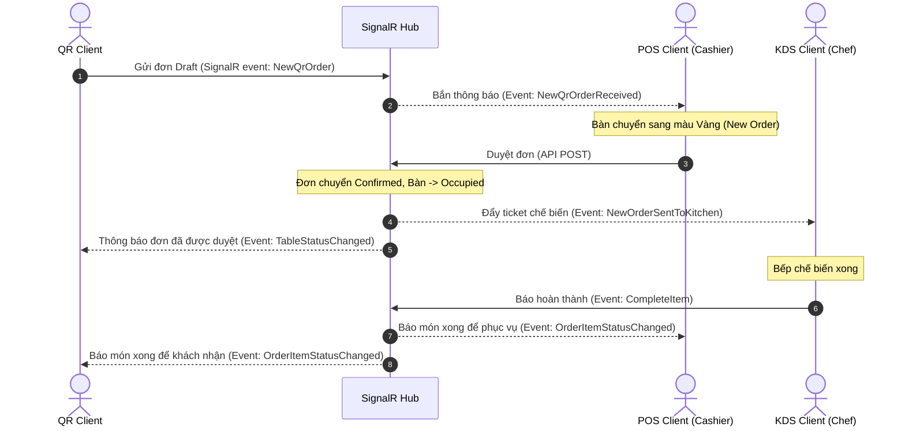
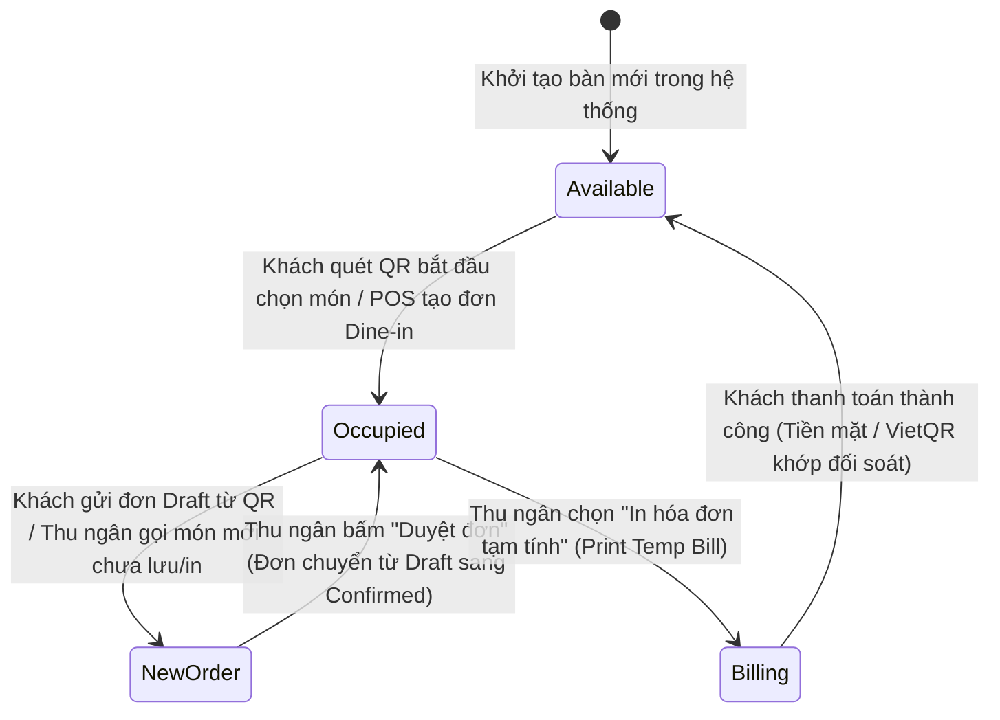
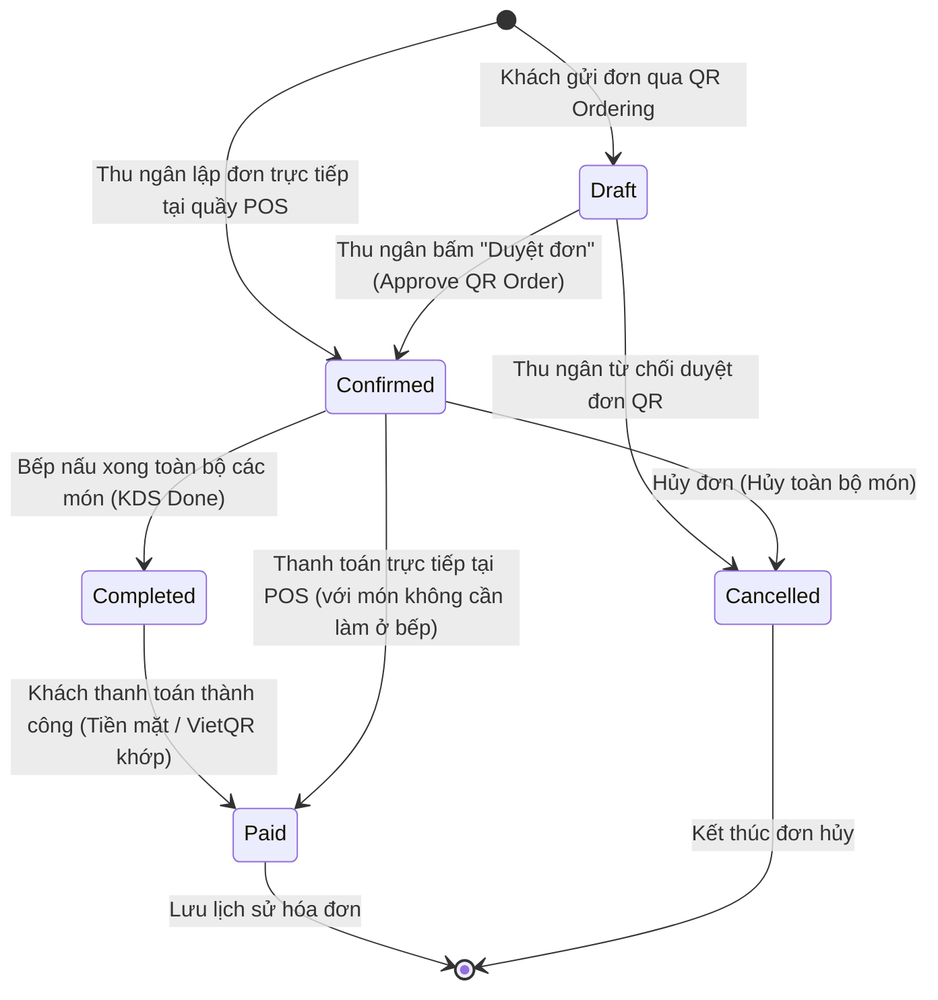
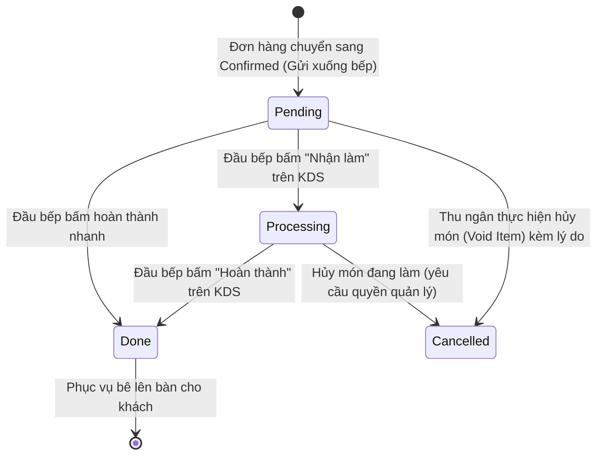
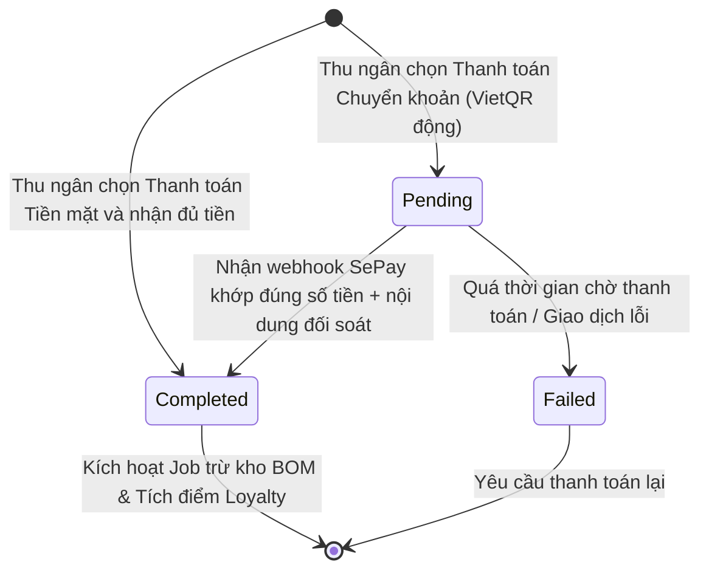
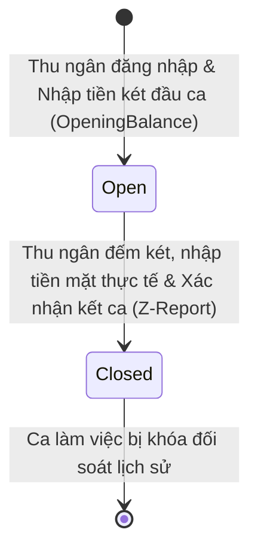
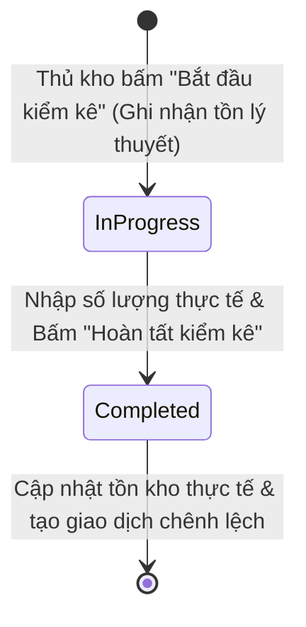

# Thiết kế Kỹ thuật (Technical Plan) — Hệ thống Restaurant POS & KDS

Tài liệu này đặc tả chi tiết kiến trúc phần mềm, cấu trúc thư mục dự án, mô hình giao tiếp thời gian thực (SignalR), cơ chế trừ kho tự động (BOM Background Job), tích hợp thanh toán (VietQR + SePay Webhook) và phân quyền xác thực (JWT + RBAC).

---

## 1. Kiến trúc Tổng thể (Clean Architecture)

Hệ thống được thiết kế theo mô hình **Clean Architecture (onion architecture)** chia làm 4 layer độc lập để đảm bảo khả năng mở rộng, bảo trì và kiểm thử đơn giản.

```text
D:\My Project\src\
├── Restaurant.Domain\            ← Không phụ thuộc vào bất kỳ thư viện ngoài nào (trừ C# Core)
│   ├── Entities\                 ← Các thực thể DB (User, Table, Order, Material...)
│   ├── Enums\                    ← Trạng thái Bàn, Đơn hàng, Trạng thái Bếp...
│   └── ValueObjects\             ← Các đối tượng giá trị (ví dụ: Money, Phone...)
│
├── Restaurant.Application\       ← Chứa logic nghiệp vụ ứng dụng
│   ├── Interfaces\               ← Định nghĩa các giao tiếp (IDbContext, ICurrentUserService...)
│   ├── DTOs\                     ← Data Transfer Objects (Request/Response API)
│   ├── Services\                 ← Business Logic (hoặc dùng MediatR CQRS)
│   └── Validators\               ← Kiểm tra dữ liệu đầu vào (FluentValidation)
│
├── Restaurant.Infrastructure\    ← Tương tác với môi trường bên ngoài
│   ├── Persistence\              
│   │   ├── ApplicationDbContext.cs
│   │   ├── Configurations\       ← Fluent API mapping tách biệt cho từng Entity
│   │   ├── Migrations\           ← Lịch sử EF Core Migrations
│   │   └── Interceptors\         ← Auditing interceptor (tự điền ngày tạo/sửa)
│   ├── Services\                 ← Triển khai các dịch vụ (EmailService, SePayVerifier...)
│   └── BackgroundJobs\           ← Luồng chạy ngầm (BOM Stock Deduction Job)
│
├── Restaurant.WebAPI\            ← Cung cấp RESTful API và SignalR Hub
│   ├── Controllers\              ← API Endpoints (POS, BOH, QR, Webhook)
│   ├── Hubs\                     ← SignalR Hubs (RestaurantHub)
│   ├── Middlewares\              ← Xử lý Exception, Logger, JWT Validation
│   └── Program.cs                ← Cấu hình Dependency Injection & Middlewares
│
└── Restaurant.Web\            ← Thư mục chứa các dự án Front-End
    ├── SharedComponents\         ← Các Blazor Component dùng chung (Button, Modal...)
    ├── Restaurant.Web.POS\    ← Ứng dụng Blazor dành cho Thu ngân
    ├── Restaurant.Web.KDS\    ← Ứng dụng Blazor dành cho Bếp
    ├── Restaurant.Web.BOH\    ← Ứng dụng Blazor dành cho Quản trị/Thủ kho
    └── Restaurant.Web.QR\     ← Ứng dụng Mobile Web tự gọi món
```

---

## 2. Thiết kế Cơ sở Dữ liệu & EF Core 9.0

### 2.1. Fluent API Configurations
Không sử dụng Data Annotations trong Class Entity để tránh phụ thuộc framework vào tầng Domain. Toàn bộ cấu hình được tách thành các file cấu hình Fluent API riêng biệt kế thừa giao diện cấu hình của EF Core trong tầng **Infrastructure**:
- Định nghĩa rõ ràng kiểu dữ liệu cột trong database (ví dụ: `decimal(18,2)` cho các cột số tiền, `nvarchar(150)` cho các cột tên).
- Thiết lập các ràng buộc khóa ngoại với hành động xóa `OnDelete(DeleteBehavior.Restrict)` để tránh cascade delete dây chuyền gây mất mát dữ liệu quan trọng.
- Cấu hình bộ lọc truy vấn mặc định (Global Query Filter) cho thuộc tính `IsDeleted` của các thực thể áp dụng soft delete (Xoá mềm).

### 2.2. Cơ chế Soft Delete Tự động
Tất cả các truy vấn nghiệp vụ mặc định sẽ tự động loại bỏ các thực thể đã xóa mềm thông qua Global Query Filter. Khi cần truy vấn dữ liệu bao gồm cả thực thể đã xóa (phục vụ báo cáo lịch sử), hệ thống sẽ dùng phương thức bỏ qua bộ lọc truy vấn của EF Core để quét toàn bộ dữ liệu gốc.

### 2.3. Tự động điền Audit Fields (EF Core SaveChangesInterceptor)
Để tự động điền các thông tin ghi nhật ký bao gồm thời điểm tạo (`CreatedAt`), người tạo (`CreatedByUserId`), thời điểm cập nhật (`UpdatedAt`), người cập nhật (`UpdatedByUserId`) mà không cần code lặp lại, hệ thống sử dụng một lớp Interceptor đánh chặn sự kiện lưu thay đổi của EF Core:
1. Kế thừa lớp đánh chặn lưu thay đổi của EF Core trong tầng Infrastructure.
2. Ghi đè (override) phương thức lưu dữ liệu đồng bộ và bất đồng bộ trước khi ghi nhận xuống cơ sở dữ liệu.
3. Đọc thông tin định danh của User đang thực hiện request thông qua dịch vụ ngữ cảnh người dùng hiện tại (lấy ra từ JWT Token hoặc Session Cookie).
4. Duyệt qua danh sách các thực thể đang nằm trong hàng đợi theo dõi thay đổi (Change Tracker):
   - Nếu thực thể ở trạng thái Thêm mới (`Added`): Tự động điền thời gian hiện tại (UTC) vào `CreatedAt` và gán UserId vào `CreatedByUserId`.
   - Nếu thực thể ở trạng thái Sửa đổi (`Modified` hoặc `Added`): Tự động cập nhật thời gian hiện tại vào `UpdatedAt` và gán UserId vào `UpdatedByUserId`.

---

## 3. Xác thực & Phân quyền (Authentication & Authorization)

Hệ thống sử dụng cơ chế xác thực dựa trên Token (JWT) kết hợp phân quyền dựa trên vai trò (RBAC):

- **JWT Token Payload:** Chứa các thông tin định danh cơ bản bao gồm UserId (Sub), tên đăng nhập, vai trò của nhân viên và thời gian hết hạn của token.
- **Phân hệ BOH/POS/KDS:** Sử dụng cơ chế kiểm tra quyền truy cập ở cấp độ Endpoint API và Razor Page Blazor. Chỉ những nhân viên có Role phù hợp với Policy được định nghĩa (ví dụ: chỉ Admin và Manager được cấu hình Menu hoặc công thức định lượng) mới được phép gọi API xử lý dữ liệu.
- **Phân hệ QR Ordering (Khách hàng vãng lai):** Không bắt buộc đăng nhập tài khoản. Hệ thống tự động cấp phát một Token phiên khách vãng lai (Guest Session Token) chứa thông tin định danh bàn ăn (`tableId`) và mã phiên duy nhất để quản lý giỏ hàng cục bộ và theo dõi tiến độ món ăn mà không bị lẫn lộn giữa các bàn.

---

## 4. Kiến trúc Đồng bộ Thời gian thực (SignalR)

SignalR đóng vai trò xương sống cho việc đồng bộ sơ đồ bàn (POS), màn hình bếp (KDS) và trạng thái đơn hàng (QR Client).

### 4.1. Thiết kế Hub: `RestaurantHub`
Tất cả các client kết nối chung vào Hub trung tâm để truyền nhận thông điệp. Hệ thống quản lý kết nối bằng cách phân chia client vào các nhóm (Groups) động:
- **`CashiersGroup`:** Nhóm nhận toàn bộ sự thay đổi sơ đồ bàn, thông báo đơn QR mới, cảnh báo giao dịch chuyển khoản bị lỗi/trùng két, cảnh báo trễ món từ bếp (`KitchenSlaWarning`).
- **`ChefsGroup`:** Nhóm nhận danh sách các món ăn cần chế biến mới được quầy gửi xuống bếp.
- **`TableGroup_{TableId}`:** Nhóm dành riêng cho các khách hàng đang ngồi tại một bàn cụ thể (nhận cập nhật trạng thái món ăn bếp làm xong, sự kiện cưỡng bức chuyển/gộp bàn `TableSessionMoved`).

### 4.2. Chiến lược Xử lý Mất kết nối & Đồng bộ lại Trạng thái (SignalR Reconnection & Resync)
Khi thiết bị POS, KDS hoặc QR Client bị mất kết nối mạng tạm thời (WebSocket drop):
1. **Auto-Reconnecting:** Client tự động kết nối lại theo chiến lược Retry lũy thừa thời gian (0s, 2s, 10s, 30s).
2. **State Resynchronization (OnReconnected):** Ngay khi kết nối thành công (`onreconnected` trigger):
   - **KDS Client:** Gọi API REST `GET /api/kds/tickets/active` để tải lại bức tranh toàn bộ các Ticket đang chờ chế biến, đảm bảo không bỏ sót đơn gửi trong thời gian đứt mạng.
   - **POS Client:** Gọi API REST `GET /api/pos/tables/status` để cập nhật lại toàn bộ màu sắc sơ đồ bàn.
   - **QR Client:** Gọi API REST `GET /api/qr/orders/active` để lấy lại trạng thái món ăn mới nhất.

### 4.3. Luồng gọi món & cập nhật trạng thái realtime



---

## 5. Tích hợp Thanh toán VietQR & SePay Webhook

Cơ chế thanh toán chuyển khoản sử dụng VietQR động để sinh mã QR và SePay Webhook để đối soát tự động tức thời.

### 5.1. Thuật toán tạo mã VietQR động
Khi thu ngân chọn thanh toán chuyển khoản, hệ thống tạo mã QR động chứa thông tin tài khoản đích của nhà hàng, số tiền cần trả và nội dung chuyển khoản được cấu trúc độc nhất đại diện cho hóa đơn đó (`SepayContent`). Khách hàng quét mã này sẽ tự động điền đầy đủ và chính xác thông tin chuyển tiền trên ứng dụng ngân hàng.

### 5.2. SePay Webhook Endpoint & Xác thực Signature + Idempotency
Khi có giao dịch chuyển khoản thành công, hệ thống SePay gửi một yêu cầu HTTP POST chứa thông tin giao dịch đến API Webhook của hệ thống:
1. Đọc luồng dữ liệu của request body để lấy payload thô.
2. Trích xuất mã chữ ký bảo mật từ HTTP Header của request.
3. Thực hiện tính toán mã băm HMAC-SHA256 trên nội dung payload thô kết hợp với API Key cấu hình trong hệ thống:
   - Không khớp: Trả về lỗi 401 Unauthorized để chặn đứng nguy cơ tấn công giả mạo dữ liệu.
4. **Kiểm tra Idempotency (Chống Replay Attack / Webhook trùng):**
   - Đọc mã giao dịch ngân hàng (`referenceCode` / `transactionHandledId`) từ SePay Payload.
   - Kiểm tra trong bảng `SepayWebhookLogs`: Nếu mã giao dịch này đã tồn tại và `IsProcessed = true`, hệ thống trả về ngay HTTP 200 OK mà không thực hiện lại logic thanh toán/trừ kho.

### 5.3. Xử lý xung đột nghiệp vụ:
Dịch vụ đối soát thực hiện kiểm tra nghiệp vụ theo quy trình sau:
- Tìm bản ghi giao dịch thanh toán chờ khớp (`Payments`) dựa trên nội dung đối soát nhận được.
- Tìm đơn hàng tương ứng với giao dịch thanh toán.
- **Trường hợp 1 (Xung đột tiền mặt):** Nếu đơn hàng đã được thu ngân bấm hoàn tất bằng tiền mặt trước đó (đơn đã ở trạng thái Paid):
  - Ghi nhận webhook vào `SepayWebhookLogs` với `IsProcessed = false` và `ErrorLog = "Đơn hàng đã được thanh toán bằng tiền mặt trước đó"`.
  - Phát tín hiệu báo động thông qua SignalR `PaymentAlert` lên màn hình POS của thu ngân để thực hiện đối soát thủ công và hoàn lại tiền thừa cho khách.
- **Trường hợp 2 (Bình thường):** Cập nhật trạng thái giao dịch thanh toán thành Hoàn tất, chuyển đơn hàng sang Đã thanh toán (`Paid`), kích hoạt xử lý trừ kho BOM trong cùng Transaction DB, tích điểm Loyalty, đồng thời phát sự kiện SignalR `PaymentCompleted` và `TableStatusChanged` để đóng modal thanh toán và đưa bàn về trạng thái Trống.

---

## 6. Luồng Trừ kho tự động theo BOM (Bill of Materials Deduction)

Để đảm bảo tính toàn vẹn dữ liệu tuyệt đối (ACID) và tránh nguy cơ mất mát dữ liệu do rủi ro server bị restart/sập nguồn như khi dùng hàng đợi bộ nhớ (In-memory Queue), việc trừ kho thô BOM được thực hiện **trực tiếp trong cùng Database Transaction (`IDbContextTransaction`)** của luồng Thanh toán hóa đơn (Checkout/Payment Process).

### 6.1. Kiến trúc Đánh chặn Sự kiện (MediatR Domain Events / Notifications)
1. Khi món ăn (OrderItem) được đổi trạng thái Bếp thành `Done`, hệ thống phát đi sự kiện `OrderItemKitchenDoneDomainEvent(OrderItemId, OrderId)`.
2. Bounded Context `Inventory` lắng nghe thông qua `DeductInventoryOnOrderItemKitchenDoneHandler`.
3. Handler gọi `IInventoryService.DeductInventoryForOrderItemAsync(OrderItemId)`:
   - Dựa trên `OrderItemId`, lấy danh sách `MenuItemId` và các `ModifierOptionId`.
   - Tính toán nguyên vật liệu (BOM) cần dùng.
   - Ghi vào `InventoryTransactions` (ReferenceType: `OrderItem`).

2. **Khấu trừ nguyên liệu thô:**
   - Với mỗi món ăn chính: Truy vấn `Recipes` -> `RecipeItems` để tính tổng định lượng nguyên liệu thô cần trừ = `Định lượng món` × `Số lượng`.
   - Với mỗi Modifier tùy chọn (Toppings, Size, món ăn thành phần trong Combo): Truy vấn `ModifierRecipes` -> `ModifierRecipeItems` để tính lượng tiêu hao tương ứng.
3. **Cập nhật Database & Audit Logs:**
   - Cập nhật giảm trực tiếp `Material.CurrentStock` trong DB.
   - Ghi chi tiết lịch sử biến động vào bảng nhật ký giao dịch kho (`InventoryTransactions`) với `Type = SaleDeduction` và gắn mã `OrderId`.
4. **Cảnh báo Tồn kho Tối thiểu (Low Stock Alert):**
   - Nếu `Material.CurrentStock < Material.MinStockLevel`, kích hoạt gửi sự kiện SignalR thông báo nổi bật lên Dashboard Quản trị và màn hình Thủ kho.
5. **Xử lý Tồn kho Âm (Negative Stock Policy):**
   - Nếu `Material.CurrentStock < Lượng tiêu hao`: Hệ thống **vẫn cho phép hoàn tất thanh toán** để tránh nghẽn tắc trải nghiệm của khách hàng tại nhà hàng. Tồn kho nguyên liệu sẽ ghi nhận giá trị âm và phát ngay thông báo Cảnh báo Lệch kho Thực tế đến Quản lý.

---

## 7. Sơ đồ Luồng Trạng thái Hệ thống (State Transition Diagrams)

Để chuẩn hóa luồng xử lý dữ liệu và các quy tắc nghiệp vụ trong toàn bộ vòng đời của các thực thể chính, hệ thống được thiết kế theo các mô hình máy trạng thái (State Machines) sau:

### 7.1. Sơ đồ Chuyển Trạng thái Bàn ăn (Table Status)
Mô tả vòng đời thay đổi trạng thái của bàn ăn trong quá trình phục vụ khách tại nhà hàng.



- **Available (Trống - Giá trị 0):** Trạng thái mặc định. Bàn sẵn sàng đón khách.
- **Occupied (Đang bị chiếm - Giá trị 1):** Khách đang ngồi tại bàn chọn món hoặc đang thưởng thức món ăn đã được duyệt.
- **New Order (Đơn mới - Giá trị 2):** Cảnh báo có món mới từ khách quét QR tại bàn gửi lên chờ thu ngân duyệt.
- **Billing (Chờ thanh toán - Giá trị 3):** Đã in hóa đơn tạm tính. Khóa tính năng tự gọi món từ QR của khách tại bàn.

---

### 7.2. Sơ đồ Chuyển Trạng thái Đơn hàng (Order Status)
Quản lý trạng thái vòng đời của một đơn hàng từ lúc khởi tạo đến lúc hoàn tất.



---

### 7.3. Sơ đồ Trạng thái Chế biến Món ăn trong Bếp (OrderItem Kitchen Status)
Theo dõi tiến độ chế biến của từng dòng món ăn trong bếp trên màn hình KDS.



---

### 7.4. Sơ đồ Trạng thái Giao dịch Thanh toán (Payment Status)
Quy trình xác nhận dòng tiền cho các giao dịch chuyển khoản VietQR và tiền mặt.



---

### 7.5. Sơ đồ Trạng thái Ca làm việc (Shift Status)
Đảm bảo quản lý dòng tiền mặt két chặt chẽ theo ca làm việc.



---

### 7.6. Sơ đồ Trạng thái Phiếu kiểm kê kho (Stocktake Status)
Quản lý quy trình kiểm kê nguyên vật liệu để cân bằng kho và tính hao hụt.



---

## 8. Cơ chế Chống Xung đột Dữ liệu (Optimistic Concurrency & Locking Strategy)

Để xử lý các tình huống nhiều thao tác xảy ra đồng thời (Concurrent Operations) như:
- Khách quét QR sửa giỏ/hủy đơn đúng lúc Thu ngân tại POS bấm "Duyệt đơn".
- Hai Thu ngân cùng bấm mở ca hoặc cùng gộp một bàn ăn.

Hệ thống áp dụng chuẩn **Optimistic Concurrency Control** của Entity Framework Core 9.0:

1. **Cấu hình `RowVersion` Column:** Các thực thể core gồm `Orders`, `Tables`, `Shifts` và `Materials` được bổ sung trường `byte[] RowVersion` (Timestamp):
   ```csharp
   builder.Property(o => o.RowVersion).IsRowVersion();
   ```
2. **Xử lý `DbUpdateConcurrencyException`:**
   - Khi có 2 thao tác ghi đồng thời vào cùng một bản ghi, EF Core tự động ném ra `DbUpdateConcurrencyException`.
   - Middleware hoặc Command Handler sẽ bắt ngoại lệ này, tự động rollback Transaction và trả về phản hồi giao diện thích hợp (ví dụ: *"Dữ liệu đơn hàng vừa được cập nhật bởi thao tác khác. Vui lòng tải lại!"*).
